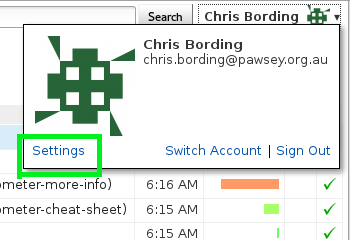
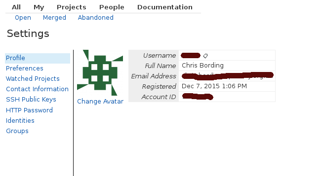
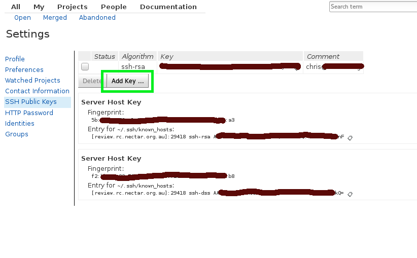

## Table of Contents


- NeCTAR Cloud Tier 0 Documentation  
  - [Licensing](#Licensing)  
  - [Sourcing content and attribution](#Sourcing)  
  - [How to contribute](#How)  
     - [Initial setup](#Initial)  
  - [Github, Gerrit and the documentation workflow](#Github)  
     - [Workflow step by step](#Workflow)  
        - [Cloning the project from github](#Cloning)  
           - [The project directory structure](#The)  
              - [What are those --DOCID things](#What)  
           - [Making some changes](#Making)  
           - [Some words about markdown](#Some)  
           - [The NeCTAR style guide](#style)  
              - [Headings](#Headings)  
              - [Text](#Text)  
              - [Links](#Links)  
        - [Submitting your changes for review](#Submitting)  
           - [Authenticating yourself to Gerrit](#Authenticating)  
           - [Who the heck is Jenkins](#Who)  
        - [Getting Changes accepted](#Getting)  
           - [What went wrong](#wrong)  
        - [Amending your changes for review](#Amending)  
        - [Cleaning up your local branches](#Cleaning)  
  - [A word of Caution](#caution)
  - [Tips, tricks and troubleshooting](#tips)

# NeCTAR Cloud Tier 0 Documentation

This repository contains documentation aimed at Tier 0 (self help) users of the
NeCTAR Research Cloud.  This repository is the master location for
documentation, content added here (by means of the workflows below) will be
visible not only on github, but at other places as well.

The purpose of this README is to give potential documentation writers (or
"contributors") a primer on the systems and workflows we use to produce the
NeCTAR documentation and allow you to contribute to it quickly.  It's suggested
that you read this README through at least once completely before starting
out.

Please note that this README and all the other documentation in this project is
a work in progress.  If you feel any of this content could be improved, please
do follow this process as best you can, and submit your changes back for
review.  Together this thing can be awesome :).


## Licensing <a name='Licensing'></a>

All documentation produced under this repository is licensed under the
[Apache v2 licence](http://directory.fsf.org/wiki/License:Apache2.0).

## Sourcing content and attribution <a name='Sourcing'></a>

Any content funded by NeCTAR is available for assimilation and standardization
into this project.  Where possible the original contributors should be requested
to contribute their documentation directly.

Copying volumes of content from the Internet is to be avoided, if said content
 is authoritative, simply link to it instead.  For example
[installing git](https://git-scm.com/book/en/v2/Getting-Started-Installing-Git)
is extensively documented at the git website already so we haven't bothered
trying to replicate it here.


## How to contribute <a name='How'></a>

For the uninitiated, the initial setup may seem daunting; there are several new
tools and concepts to learn.  Some or all of these tools you may have used
before, so hopefully you're not starting from scratch :).  But once you are
up to speed you can create documentation and contribute code across the entire
NeCTAR project.

If you get stuck talk to the nectar docs team or ask on the #nectar IRC channel
 on freenode.
 


### Initial setup  <a name='Initial'></a>

You need to understand basic concepts around

- operating a computer via the command line.

- [git and branching](https://git-scm.com/book/en/v2/Git-Branching-Basic-Branching-and-Merging).

- writing documentation for github in [github flavoured markdown](https://help.github.com/articles/github-flavored-markdown/);

- using ssh-keygen, as you will need a new set for `git review`.

and then finally, you'll need to become familiar with

- the git code review platform [Gerrit](https://code.google.com/p/Gerrit/);

- [github](https://github.com/about); hosts thousands of git repositories

Now don't worry too much, this README is aimed at taking the pain away from
learning all of that and intends to provide step by step instructions to guide
you along the way.

Note that git and git-review are command line programs - they don't come
with a graphical user interface - and whilst one or another graphical front end
 may (or may not) work, how to make them work is outside the scope of this
document.

## Access the the NeCTAR-RC/nectarcloud-tier0doco repository

You will need to create an account on github if you don't already have one.

- Email [Sarah Nisbet](mailto:sarah.nisbet@ersa.edu.au) with your github username to be added as a member to the nectarcloud-teir0doco project

Initially you will need to install (or have access to) and setup the following tools;

- The leading distributed version control system [git](https://git-scm.com/book/en/v2/Getting-Started-Installing-Git)

- The git plugin for Gerrit [git-review](https://www.mediawiki.org/wiki/Gerrit/git-review)

- a launchpad id to authenticate yourself to Gerrit 
  
  - [launchpad login](https://login.launchpad.net/)
  - [Gerrit login](https://review.rc.nectar.org.au/login)
  - create a new set of ssh keys using `ssh-keygen -t rsa -f my_gerrit.key` then copy both files to your $HOME/.ssh directory. 
    This is needed for a passwordless login for the `git review`   
  - Once you are able to login to the Gerrit via launchpad you will need to create a Gerrit "username" and add the new set of 
    ssh keys. This is done within your account/profile settings



- add a username `Look_ma_Im_using_Gerrit`



- click on the Add Key button and copy your `my_gerrit.key.pub` into the field provided.



- Test `git-review` by using the ssh -p 29418 `Look_Ma_Im_using_Gerrit@review.rc.nectar.org.au`
  - if successful you should get back somthing like this....
  
  `****    Welcome to Gerrit Code Review    ****`

  `Hi Chris Bording, you have successfully connected over SSH.`

  `Unfortunately, interactive shells are disabled.`
  ` To clone a hosted Git repository, use:`

  `git clone ssh://Look_ma_Im_using_Gerrit@review.rc.nectar.org.au:29418/REPOSITORY_NAME.git`

  `Connection to review.rc.nectar.org.au closed.`
  
   
- email, text editors and other such things.


## Github, Gerrit and the documentation workflow <a name='Github'></a>

Unlike other github projects, you can't edit the NeCTAR content directly on
github.  This is because we use Gerrit to do the peer review and checking of
content _before it is uploaded_ to github.  That may seem odd, but github
doesn't offer a sophisticated enough review system, so for that we use Gerrit.
 Gerrit sits between you and github.  To make it a little clearer, documentation
 (or content) in this project follows this workflow;

     +-----------------+
     |                 |                                   Content is visible
     |  Contributor    |                                   here, but should
     |  clones project |                 +------------+    be cloned to your own
     |  to their       |<----------------|            |    computer to edit it
     |  computer       |                 |  New doco  |             +
     |                 |         +------>+  Appears   | ------------+
     +-+---------------+         |       |  on github |
       |                         |       |            |
       |          +--------------+-+     +------+-----+
       |          |                |            |
       |          |  contributor   |            |
       |          |  submits doco  |     +------v-----+      +---------------+
       |   +----->+  to review via |     |            |      |               |
       |   |      |  Gerrit.       |     |  Markdown  +----->+ Freshdesk     |
       |   |      |                |     |  2         |      |               |
       +   |      +--------+-------+     |  HTML      |      +---------------+
       V   |               |             |            |
     +-----+-------+       |      |      +-------+----+
     |             |       |      |              |          +----------------+
     | Contributor |<------+      |              |          |                |
     |  writes in  |              |              +---------->  Some other    |
     |  markdown   |              +                         |    place?      |
     |             |        Sometimes this review           |                |
     +-------------+        can take a few iterations       +----------------+
                            before your doco is
                            approved.  Don't be offended :)

                                                          http://asciiflow.com/

### Workflow step by step <a name='Workflow'></a>

Take your time and read through this slowly, don't be afraid to ask for help :).

#### Cloning the project from github <a name='Cloning'></a>

Firstly you need to clone the whole documentation project from Gerrit down to
your own computer so you can make changes to it.

- open up a command prompt (windows) or terminal window (OSX & Linux)

- change directory to wherever you want these files to live; in your home folder
 is fine, but it's up to you.

- to clone the documentation repository to your computer, paste in the following
 line and hit enter

    `git clone https://github.com/NeCTAR-RC/nectarcloud-tier0doco.git`

- Open the newly created nectarcloud-tier0doco directory and see what's in it.

[Further documentation on cloning repositories](https://help.github.com/articles/cloning-a-repository/)
 can be found at github.

##### The project directory structure <a name='The'></a>

Now you have the project cloned locally, you can start having a look around and
hopefully making some valuable changes :) All the content we are creating
should be created under the correct folders.  That way it can be parsed and
imported correctly into Freshdesk.

All the content we create should be under  
articles/NeCTAR Documentation--DOCID16/  
or  
articles/Cloud Expert--DOCID19

Underneath that your content must be structured in accordance with the
[action list content google document](https://docs.google.com/spreadsheets/d/1jSReAxlDlqVktTXUbjnprH04vki8ZKBVKXPDQd20JZA/edit#gid=0).
so have a look at that and you will see the folder structure laid out from left
to right.

Thusly, content would be named NeCTAR Documentation--DOCID16/'Folder
Name'/'Solution Name'.md

If you are not sure where to create content, then ask one of the tier0 team.

###### What are those --DOCID things <a name='What'></a>

The --DOCIDX is an internal reference created by the import to Freshdesk.
If you are creating a new document, that reference will be added automatically
you don't need to do anything extra.

If the file you wish to edit has one of those already, then leave it intact;
changing the --DOCID for an existing article will cause Bad Stuff (tm) to
happen.

You can rename an article by changing the filename, but do still leave the
--DOCID alone.

If you need to resubmit an article after a gerrit reset, remove the DOCID from the article title, the article will need to be submitted as a new article after a reset.

Approvers: Never merge a new article that has a DOCID already in the title (it makes docobot have a tantrum).

##### Making some changes <a name='Making'></a>

We use the branching feature of git to keep your changes separate from
 other peoples changes.
 
- Before you create a branch, make sure your directory is up-to-date 
    `git checkout master`  
    `git pull`  

- create a new git branch for your changes.  The branch name should be one word
 and explain what your change is about.  For example, the content you are
reading was created on the "contributing" branch.

    `git branch branch_name`

    `git checkout branch_name`

- if the file doesn't exist yet, then create it under the starting-doco folder.

it may get moved elsewhere after that, but it's a good start.

- using your text editor, open the file you wish to edit.

- make your changes to the file.

##### Some words about markdown <a name='Some'></a>

This README and also the documentation committed to this project were all
created in github flavoured markdown. Markdown is just a way of making plain
text appear as structured formatted rich text.  A simple example is by adding
a # to the start of a line in markdown makes that line appear as a heading;

`# The largest heading (an <h1> tag)`

`## The second largest heading (an <h2> tag)`

There are heaps and heaps of ways of controlling the look and feel of your
content via markdown.  But Jenkins (we'll talk about him later) will be quite
fussy about how your format your markdown.  So while the best bet is to review
the official documentation on [github flavoured markdown](https://help.github.com/articles/github-flavored-markdown/).
just be aware, that what you produce will be tightly controlled by Jenkins.

New users may struggle with markdown, because unlike a word processor you don't
get to see exactly how your content will appear to readers.  That's because
github renders your markdown into HTML moments before readers see it.  It's
exactly the same as as when writing in other markup languages such as HTML.

One thing to note is that github flavoured markdown will treat carriage returns
in an interesting way.  Carriage returns are ignored by github unless they come
in a pair.   That means that the carriage return at the end of a line is ignored
, but if it is followed immediately by another carraige return at the end of a
paragraph, then github will render your text as a paragraph.

*It is* possible to render your markdown locally, which is invaluable if you're
creating content and you do care about how it appears to end users.  This is
possible using [grip](https://github.com/joeyespo/grip) which does require you
to have some familiarity with installing python packages, but for Ubuntu it's as
simple as

`$ sudo apt-get install python-pip`

`$ pip install grip`

`$ grip --gfm --context=NeCTAR-RC/nectarcloud-tier0doco README.md`

And then I simply point my web browser at [http://localhost:6419/](http://localhost:6419/)
and voila, there's my markdown rendered into html.

You can also find tools such as online tools that will render markdown documents (e.g. <https://stackedit.io/editor> - copy/paste your text into the left pane)

##### The NeCTAR style guide <a name='style'></a>

All commits to this repository must pass markdown validation as applied by
a robot called Jenkins - he's pretty fussy - but can be tamed easily; more
on that later.  Where markdown may be valid, but stylistic choices are still
possible, please consider the following.

###### Headings <a name='Headings'></a>

H1 is for the page title and H2 onwards are for sub-headings. Jenkins will
prevent you from putting a lower-number heading before a higher-number heading

###### Text <a name='Text'></a>

Markdown defaults to left aligned text, it's important not to change this as
it's generally accepted that centred text is harder to read.

Underline is for hyperlinks ONLY. Instead, use bold or italics for emphasis.

Don't change the colour of the headings and paragraph text.

###### Links <a name='Links'></a>

All links should open in the same window, even external links. This ensures the
website meets basic web accessibility standards. Yes, it's kind of annoying, but
it means that the user gets to decide how they want their links to open.

Link text should be meaningful - don't use phrases like 'click here' - and
should be embedded behind text where possible; try not to paste full URLs onto
the page.

The syntax is
    in text link: [hypertext][link identifier]
    at the bottom of the page: [link identifier]: http://url

###### Images

Images should be stored in the "images" directory, which is in the same directory that the article is saved. You can then link to the images with e.g.:  
`

#### Submitting your changes for review <a name='Submitting'></a>

A host of people will be very excited to see your new changes and will help you
ensure that your content meets the standards.  For them to be able to see your
content, you need to upload it back to Gerrit, and that's what git-review is for.

Assuming you made some changes to one or more files previously, you need to
upload those changes for review to Gerrit.  But before you can do that, you need
 to commit the changes to your local git repository.

- you can see which files have changed by using

    `git status`

- if any of those are the files you care about, you should add them to your next
 commit.

    `git add <file>`
    
    Quick tip: use `git add -A` if you want to add ALL the files mentioned in the `git status` readout.

- then you need to commit your changes

    `git commit -m 'a meaningful comment about the change you are committing'`

adding a useful message which explains exactly what your commit is about.  You
should consider formatting your commit message with a less than 10 word subject
up the top, then if any further explanation is required, do that in a separate
paragraph underneath.

- now you need to upload this change to Gerrit for review by Jenkins and others 
  this step will fail, but that's ok for now. (Make sure you have installed the 
  git plugin for Gerrit, [git-review.](https://www.mediawiki.org/wiki/Gerrit/git-review))

    `git review`

Why not `git push`?  Good question.  Because we're not pushing back to github,
we're having our commit reviewed by Gerrit.  If Gerrit and others think your
commit is ok, then (and only then) Gerrit will push to github for you.  You
can't push directly to github yourself because only Gerrit is authorized to
push to the nectar github repository.

For further information on making changes to NeCTAR repositories using git
review, [please refer to the NeCTAR wiki](https://wiki.rc.nectar.org.au/wiki/ChangeWorkflow#Making_changes.)

##### Authenticating yourself to Gerrit <a name='Authenticating'></a>

Okies, so by default, you are a stranger to Gerrit.  When you do your first
`git review`, git will use your ssh key to talk to the Gerrit server at
review.rc.nectar.org.au.  In the first instance, that will probably fail.

You will then need to [create an account with Gerrit](https://wiki.rc.nectar.org.au/wiki/SettingUpGerrit)

Specifically, you need to make sure that your gerrit account (and it's
associated username) have permissions to contribute to the tier0doco project.
If you `git review` fails with an authentication error, then this is your
issue.  [Log an issue with core services to have your account added.](http://support.rc.nectar.org.au/docs/support)

##### Who the heck is Jenkins <a name='Who'></a>

It will happen sometimes that regardless how hard you try, somebody will find
fault in your commit, and will ask that you amend it.  It's important to
remember, that should you be asked to review your commit, it's not a personal
affront :) it's just the means by which the documentation standards can be
maintained.

The first "person" to find fault will be Jenkins.  Jenkins is a robot and he
will ensure that your markdown meets the standards set by the [lint ruleset](https://github.com/mivok/markdownlint/blob/master/docs/RULES.md)
You may like to keep that link handy; Jenkins is quite fussy, and you'll need
to understand why he keeps complaining.

Some examples of Jenkins feedback;  
`./README.md:262: MD009 Trailing spaces`  
`./README.md:263: MD009 Trailing spaces`  
`./README.md:31: MD013 Line length`  
`./README.md:138: MD022 Headers should be surrounded by blank lines`  
`./README.md:119: MD024 Multiple headers with the same content`  
`./README.md:237: MD026 Trailing punctuation in header`  
`./README.md:49: MD032 Lists should be surrounded by blank lines`  
`./README.md:51: MD032 Lists should be surrounded by blank lines`  
`./README.md:53: MD032 Lists should be surrounded by blank lines`  

You'll need to fix each of those and when Jenkins finally accepts your change
(see amending changes below), Jenkins will automatically vote (or +1) your
commit.

  Jenkins will often fail a document without giving any reasons. Using the following ruby-gem markdown lint style checker (mdl) will give you the reasons when Jenkins won't. It is a real timesaving tool!

Note; if you want to get really clever, you can install mdl - the same markdown
parsing tool that Jenkins uses - that way you don't need to bother Jenkins for
markdown related issues.  You'll probably need ubuntu for this;

`$ sudo apt-get install ruby`  
`$ sudo gem install mdl`  
`$ mdl README.md`  
`README.md:4: MD013 Line length`  
`README.md:4: MD009 Trailing spaces`  
`README.md:51: MD032 Lists should be surrounded by blank lines`  
`README.md:222: MD032 Lists should be surrounded by blank lines`  

or even better, markdown parsing in near realtime with
`watch mdl README.md`

Once your markdown is clean, then do your `git commit --amend`

If you do decide to use mdl locally, there is a file in the root directory of the project named `md_style.rb`
with rules that match those applied by Jenkins. There are further instructions in the file on how to use it.

This works for me (JoeyGerlach):
`mdl -s ~/nectarcloud-tier0doco/md_style.rb <filename>`

#### Getting Changes accepted <a name='Getting'></a>

As well as Jenkins, actual people will read your changes.  They - like
Jenkins - will have their suggestions, and you will need to satisfy them as well
so that your content can finally be accepted.

You need two +1 votes (or one +2) for your change to be accepted, merged and to
 appear back at github.

 This can take time.  This README has currently been submitted a dozen times
 already.  Apparently some commits in the OpenStack tree can take over 50
 amendments before they are finally accepted (but don't worry, that's not
 likely to happen to you - we want your docs!).

##### What went wrong <a name='wrong'></a>

Jenkins should email you advising what was wrong with your submission.  If
you follow that link you'll see the option on the left for the "console
output", click on that and scroll down and you'll see what He's complaining
about.

You can also get there by finding your submission on the list at our [gerrit](https://review.rc.nectar.org.au/#/q/status:open)
.  Click on your submission, then down the bottom you will see the Jenkins
feedback; click on that and the hyperlink referred to above should be
visible there too.

#### Amending your changes for review <a name='Amending'></a>

So as we've seen, it's almost guaranteed your first commit will not be accepted
(or "merged").  It's important that you don't submit your changes as a separate
 commit, but that you amend your existing commit.

That's a simple process of;

- making the required changes

- `git add <filename>`

- `git commit --amend`

- `git review`

And waiting for some more feedback via email.

See the NeCTAR wiki for more documentation on [making changes after commiting](https://wiki.rc.nectar.org.au/wiki/ChangeWorkflow#Making_more_changes_after_committing.).

After this, you can return to the master branch and update it. It is important to update the master branch each time before you create a new branch and make modifications. Use these commands before and after you make modifications to the git repository.

`git checkout master`  
`git pull`  

#### Cleaning up your local branches <a name='Cleaning'></a>

This workflow can lead to a lot of local branches on your machine that have been merged into the master branch.
If you want to delete one, the command

```bash
git branch -d <branch_name>
```

will remove it.
 
If you want to delete a lot of them, the utility script `cleanup_branches.sh` in the root directory of the project
will do the job (it only works on Linux and OSX, sorry).
 
To use it, make sure you are in the root directory of the project, then type:

```bash
./cleanup_branches.sh 
```

## A word of Caution <a name='caution'></a>

We've learned a few cautionary tales by trial and error. Please add to this list if 
you dicover any new ways of making the system have a tantrum.

- After your changes are merged, there is a script called "Docobot" that pushes the changes to freshdesk, which updates the website (usually within a minute of the change being merged). Sometimes changes are accepted and merged, but cause docobot to stop working as the changes are not compatible with the freshdesk settings.
  - Don't make any new folders in the top category, or increase the number of sub folders allowed (i.e. no subfolders in Level 3, see below). 
     - Level 1 - "Cloud expert" and "NeCTAR documentation" ONLY
     - Level 2 - Sub folders ONLY, e.g. "Cloud Basics", "Security guidelines"
     - Level 3 - .md articles, and a folder called "images" for the image files ONLY
  - Adding sub-folders at level 2 has been successful (remember to add it without any DOCID, this will be assigned automatically). Add the folder at the same time as you add contents to the folder as docobot ignores empty folders.
  
  - Never submit a new article or directory with a DOCID. Docobot will automatically add a DOCID after the merge. If Gerrit is reset for some reason (as a troubleshooting measure), you may need to re-commit a new article that was merged in the period that has been rewound. In this case, the article was given a DOCID already, but because of the reset, the DOCID needs to be deleted from the filename before it can be resubmitted.

## Tips, tricks and troubleshooting <a name='tips'></a>

- The title of the article is the same as the filename of your .md file (minus the DOCID bit). Thus it is important that you use spaces rather than underscores between words in the filename.

- If you forget to checkout a new branch before making your changes, and have been modifying the master branch instead;
  - Create a new branch and the modifications you have made will be transferred to this branch for you to add, commit and merge.
  
- If there have been a lot of changes in the master branch since you did your last `git pull`, your changes may create a 'merge conflict'
  - Create a local copy of any changes you have made (e.g. on your desktop)
  - Delete the NeCTAR tier 0 directory from your computer, then clone it again with  
  `git clone https://github.com/NeCTAR-RC/nectarcloud-tier0doco.git`
  - Create a new branch and paste the modified/new articles into the directory
  - Continue with adding and committing the changes as usual.

### Some things Jenkins is fussy about - please add to list

- There is not allowed to be punctuation at the end of a sub/heading
- There is not allowed to be a single sentence paragraph with emphasis (use subheadings instead)
- There must be blank lines before and after headings and lists (check for automatically inputted indentation spaces)
- If there are MS-DOS line breaks, Jenkins won't recognise blank lines and will call errors. Convert your file to UNIX line breaks only.
- Jenkins is very fussy about list syntax. Be consistent. If you want a numbered list with e.g. screenshots in between list elements, Jenkins won't let you assign numbers and will call each element **'1. '**
  If you want to define your own list numbers, use parentheses e.g. 1) 2)... as Jenkins won't recognise this as a list and won't give you an error message.
- If you want to preserve a single line break, use two spaces at the end of the line before hitting enter. This will prevent the lines from concatenating into a single line.

