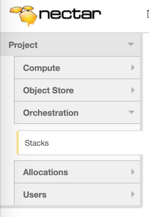
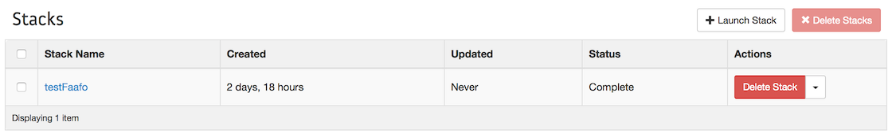
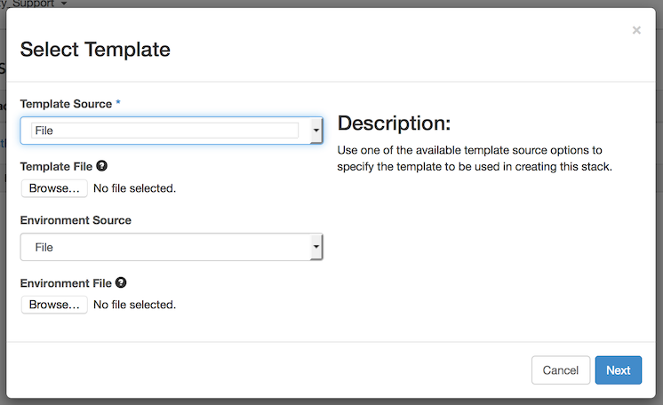
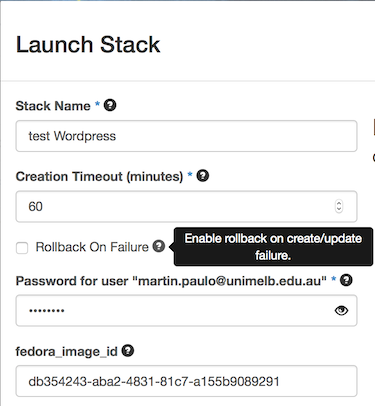

# Heat: the dashboard

On the research cloud [dashboard project panel](https://dashboard.rc.nectar.org.au/project/)
there is a side menu heading named "Orchestration". It has a sub menu entry
titled ["Stacks"](https://dashboard.rc.nectar.org.au/project/stacks/):



When you select it you will see a list of the stacks that you have created, and
to the top right, a button pair, one labelled "+ Launch Stack", the other
"✖ Delete Stack":



Pressing the "+ Launch Stack" button creates a dialogue that invites you to
provide a Heat template.



The dialogue offers you three ways of providing a template via the "Template Source"
drop down:

* `URL` - The template can be reached via a web browser, and you are going to
  provide the URL it can be found at;
* `File` - You are going to upload the template from your local machine;
* `Direct Input` - You will type the template in by hand.

Dependent on which selection you make in the "Template Source" drop down, the
dialogue will reconfigure itself to allow you to provide the required information.

The dialogue also offers you the chance to provide an "Environment Source".
This is also in the form of a drop down, but here the choices are limited
to:

* `File` - You are going to upload the environment from your local machine;
* `Direct Input` - You will type the environment in by hand.

Again, dependant on which selection you make, the dialogue will reconfigure
itself to allow you to provide the required information.

An [environment](http://docs.openstack.org/developer/heat/template_guide/environment.html)
simply allows you to provide parameter values and to define custom resources.

In this example we are going to use one of the NeCTAR Heat sample templates.

So in the Template Source field select "URL", then in the "Template URL" field
enter:

[https://raw.githubusercontent.com/NeCTAR-RC/heat-templates/master/juno/Fedora/wordpress_single_instance.yaml](https://raw.githubusercontent.com/NeCTAR-RC/heat-templates/master/juno/Fedora/wordpress_single_instance.yaml)

Then in the Environment Source field select "Direct Input", then in the environment
data edit box type the following `yaml` (taking care to enter the correct values):


```

parameters:

  # your nectar keypair name instead of 'nectar_demo'
  
  key_name: nectar_demo
  
  # the latest nectar fedora image id
  
  fedora_image_id: db354243-aba2-4831-81c7-a155b9089291
  
```

Once you are done press the "Next" button.

All going well, you should now be presented with a page titled "Launch Stack".
It will be a form that is made up of fields that are taken from your template's
parameters.

Next to each field is a small question mark icon. As it gains focus, so the user
will be shows the parameters comment field as a help bubble to the right.



The value entered into the "Stack Name" field is used to give a name to the stack
that is going to be launched by Heat. This name must start with a letter and may
only contain letters, numbers, underscores, full stops and hyphens...

The "Creation Timeout (minutes)" field is the number of minutes that should be
allowed for the stack creation to take. If this time is exceeded then the stack
creation will be aborted.

The "Rollback On Failure" field, if checked, will ensure that the complete
stack gets deleted if there is a failure in creation. If it's not checked then
you will have to manually delete the stack should there be a failure in the creation.

The rest of the fields are taken from the template that has been uploaded.
You should find that the values you entered in the environment file
have been used to fill the fields. Otherwise, simply provide the requested
values then select the "Launch" button.

All going well, the stack should be created. Once created you can select it
in the lists of stacks that are active, drilling down into its
particular details.

When you are finished with a stack, you can simply hit the "Delete" button
next to it on the stack listings. If you want to delete more than one
stack, select the checkboxes next to them and hit the "✖ Delete Stack"
button.
