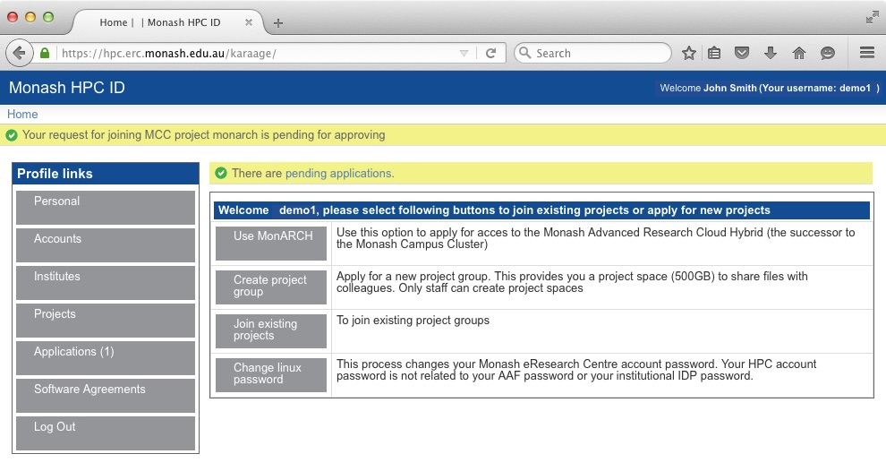

# How to Access MonARCH

To access MonARCH you will need to

* Create a username and password for the Monash HPC systems
* Request access to the MonARCH resource
* Use SSH or Strudel to access MonARCH

## Apply for access to Monash HPC systems and MonARCH

1. From a web browser, visit [The Monash HPC Identity Management System](https://hpc.erc.monash.edu.au/aafbootstrap)

This web page will bootstrap your Monash HPC account using information provided
by your Institution and the AAF.

Depending on your settings, usually the next step will be to select your
institution, in this example, "Monash University".

2: You will be redirected to your institutions secure Identity Provider
service. You should enter your institutional username and password to
authenticate to your institution.  In the background, your institution will
tell us information like your Name and email address (but never your password).
Depending on your settings, you may be asked to approve your institution
telling us this information.

3: The next step is Username Selection. You will be presented with a list of
available usernames, It is important to note that this username is not
necessarily the same as your institute username. This username is for SSH and
SCP access to the MonARCH login node.

In the example below, the user's University username is "authcate" but their username
for MonARCH is "demo1".

4: Apply to access MonARCH. Select the **"Use MonARCH"** option.

This will send a request to the MonARCH team to approve access to the cluster.

The above screen-grab shows that the application is pending for approval.

The application will the go through an approval process. First the project
leader will approve the application, then the administrators will approve the
application While the approval process is ongoing, if you click on the
**"Applications"** button you should see something like this:

![Screen show of HPC ID system in waiting for admin state)(images/wait_admin.jpg)

Once the application has been approved, you'll receive an email and be able to
move onto the next step.

5: Change your MonARCH cluster password. Note that this *DOES NOT* change your
Institutional password. Choose **"Personal"** and click **"Change Password"**.

Important: This *DOES NOT* change or affect your Institutional password. This
password is for SSH and SCP access to the cluster.

## Accessing MonARCH

### Using SSH

You will need to use ssh (secure-shell) to login to the head node. This program
encrypts your interactions with the server. How to get and use ssh depends upon
your desktop operating system.

#### Linux and MacOS

Linux and MacOS both have SSH built in. Simply open a terminal and type

> ssh *username*@monarch.erc.monash.edu.au

where *username* is the selected username from Step 3. In the above example,
the username is "demo1", so:

> ssh demo1@monarch.erc.monash.edu.au

#### Microsoft Windows

ssh is not native to Windows, but you can download several free versions. Many
Monash PCs have a version of ssh installed already on them.

##### putty

You can download putty from [the putty website](http://www.putty.org/) Once
installed you run putty:

> Start->All Programs->PuTTY->PuTTY

Select “Session:” on the left pane.

In the text box on the right pane labelled **"Host Name (or IP address)"**
enter **monarch.erc.monash.edu.au**

Click open. You will be prompted for your username and password. These are the
username and password you set for the Monash HPC ID system, not your
institutional username and password.

