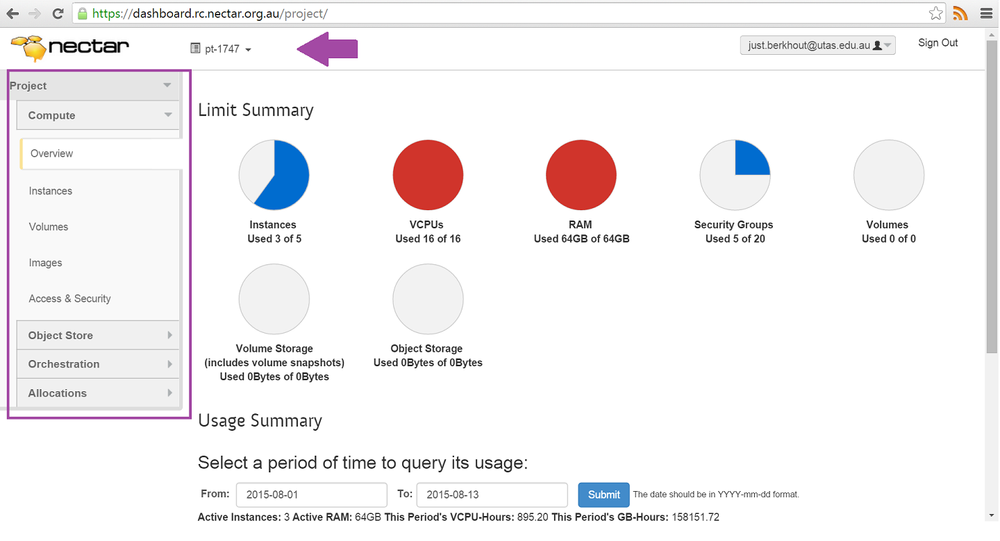
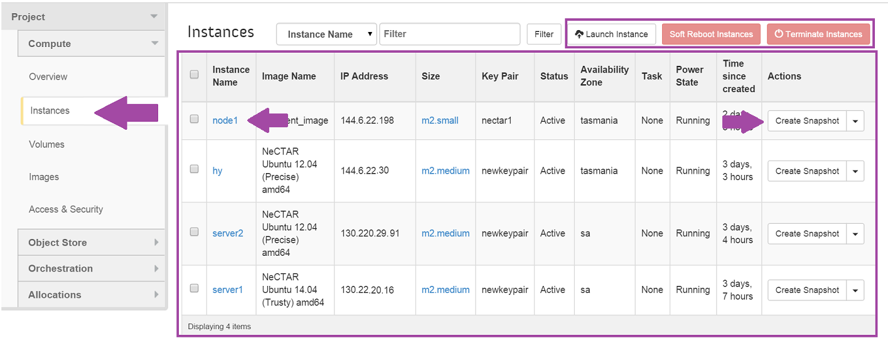
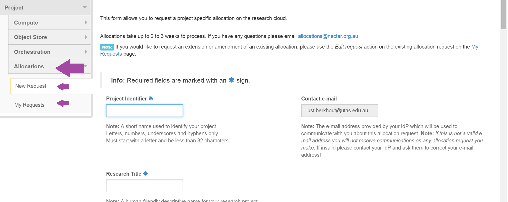

# The Nectar Dashboard

The Nectar Dashboard is the first and easiest way to manage your VMs in the
Nectar cloud. You will find a guide to the Dashboard below. You can find the
Nectar Dashboard at [https://dashboard.rc.nectar.org.au/][The Dashboard], where you'll
be asked to log in with your AAF credentials.

## Overview

The first screen you'll see when you log on to the dashboard is the **Overview
screen**. It has a familiar **navigation panel** on the left-hand side and a
central space that shows your Dashboard information. On the overview screen,
this information consists of pie charts indicating the resource usage (e.g.
number VCPUs in use) in your allocation. An important part of your Dashboard
is the **Project Selector** on the top-left-hand side: if you manage more than
one project on the Nectar cloud, this selector will determine which project
your Dashboard information relates to.

## Instances

You reach the **instances screen** in the dashboard by clicking the Instances
tab in the navigation panel. The central space now shows information about the
instances in your project, including their Name, IP Address and other information.

Beside a filter function at the top of the table (which can be handy if your
project contains many instances), there are some **command buttons** (e.g.
Launch Instance). You can find **detailed information** for each instance by
clicking the Instance Name and you can perform a number of administrative
Actions on each VM by making a selection from the instance's corresponding
**Action selector**.

You can find similar information screens for information about your
**Volumes**, **Images** and **Access & Security** using the navigation panel.

## Allocations

You use the Allocations screens for managing allocation requests. You can
start a new allocation request using the New Request tab, and, on the My request screen, 
you can find information about any existing request that you may have. You can also use 
the My Request screen to request amendments to any
of your allocations, should you need additional (or fewer) resources.

## Other features

All basic features for managing your Nectar OpenStack VMs, including
**Orchestrating** a stack of them, and various **Storage options** are in 
the Nectar Dashboard. Additional features can be accessed using Command 
Line Interface or one of the OpenStack APIs.

[The Dashboard]: https://dashboard.rc.nectar.org.au/

