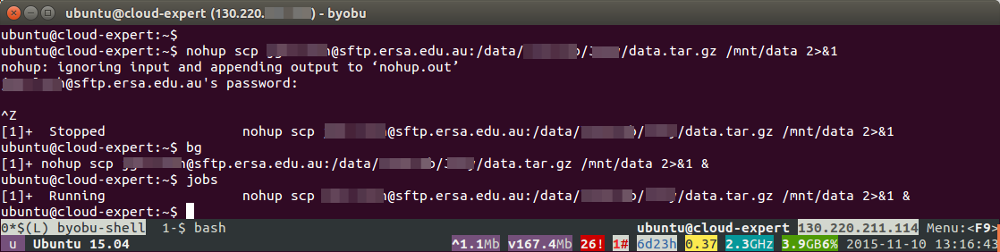

Running Jobs on your VM

## Contents

- [Keeping jobs running when your SSH connection is lost](#running)
  - 1) [Nohup - detaching a job from the terminal](#nohup)
  - 2) [GNU Screen - keeping the terminal session running](#screen)
- [GNU Parallel - putting multiple processors to work](#parallel)
- [Appendix - examples of using the commands](#appendix)

Two major features of Cloud Computing are: 

1. Keeping long-running memory/CPU intensive processes running on a dedicated server; and  
1. The flexibility to launch a VM with a large number of CPU (processors) to run 
  some processes more efficiently.

There are a few UNIX tricks that can help you use these features effectively.

## Keeping jobs running   

### How to close your terminal/SSH session, while keeping your processes running on the VM

Generally, your instance is kept running for long periods. Unlike your local computer, 
the VM's do not automatically go to sleep when there hasn't been input.  They are ideal for running 
large jobs that may take a long time to complete.

When running a process from the command-line in Terminal, the default action is
for the job to be attached to the terminal session, and to terminate if the terminal session ends.
This means that the jobs will be terminated if your local computer goes to sleep, or drops the SSH connection to the VM.

There are two main methods to keep jobs processing on the VM without the need to keep the 
SSH terminal session running on your local computer.

1. Detaching a job from the terminal session ( `nohup` and `disown` )
1. Keeping a virtual terminal session running ( GNU Screen )

## 1. Detaching a job from the terminal   

### Background and foreground jobs

Usually we run processes in the ***foreground***: 

- Our terminal window is busy until the process is finished, 
- Standard output and error messages are printed to the terminal window 
- If we close the terminal window, the process will terminate.
  
We can instruct terminal to run processes in the ***background*** **( `&` )**:

- The terminal window is not involved in the process, it is available for other commands
- The standard output and standard error are still printed to the window
- If we close the window, the process will still terminate 
- just put a space and "&" at the end of your usual command  
  e.g. `sleep 20 ` - the terminal window will be unresponsive for 20 seconds  
  `sleep 20 & ` - sleep command executes in the background, and the window remains responsive

### Nohup with background

The command **`nohup`** ensures the command does not receive a 'hang-up' signal 
when the terminal session ends.

Using ***nohup*** combined with background:

- The terminal window is available for other commands
- Standard output is printed to file ('nohup.out') 
- Closing the terminal session will not terminate the process (nohup = no hang-up)
- Modify commands as follows:  

` nohup <normal commands go here> 2>&1 & `

**`nohup`** detaches the command from the terminal session 
**`2>&1`** sends the standard error and the standard output to the log file 'nohup.out'.  
  You can enter ` 2> /dev/null < /dev/null ` instead to discard standard error messages.
**` &`** at the end send the process to the background.

### Nohup in foreground

The 'nohup' command can be used without running the job in the background by omitting the '` & `' at the end.
This is useful when you need to provide input after entering a command (such as a password).

To move any process to the background, pause the job with **'control' + 'Z'**, then enter **`bg`**

- `nohup <commands that start a job> 2>&1`  
- Enter any input at prompts (e.g. password, input parameters for a program)  
- 'control' + 'Z'  -  to pause the job  
- `bg`  
- check the job is running with `jobs` or `ps` or `top`

There is a detailed example of this process [at the end of this article](#egnohup) 

### Disown: detaching a job after it has started

If you didn't  enter `nohup` at the beginning of a command, but you want to ensure it keeps running when your SSH 
session ends, there is a command to detach an active job called **`disown`**. The job needs to be paused with
'control' + 'Z' before entering the command `disown`.

- `<command that starts a job>`  
- 'control' + 'Z'  -  to pause the job  
- `bg`  
- `disown`  
- Check that the process is running with `ps` or `top`

There is a detailed example at the [end of this article](#disown)

----

## 2. Keeping the terminal session running with Byobu / GNU Screen  

There are a couple of utilties that provide a 'virtual terminal' that will keep running 
on the server without the user having the terminal application open and actively
engaged in SSH connection with the VM. These utilities are GNU Screen and TMUX, and this article 
will cover using Screen with the front-end package Byobu.

- It keeps your terminal session running perpetually, you can reconnect at any time 
- This includes keeping active any running processes attached to the terminal session
- It will preserve processes in the foreground, or in the background
- The next time you log in, the terminal session will be preserved as you left it
- It is a good idea to use it with `nohup` commands for extra insurance

Some VM users prefer not to use a virtual terminal utility beacause:

- Learning curve : Byobu/Screen has its own set of [commands](#byobu) to familiarise yourself with.
- Running a virtual terminal is more memory intensive than simply using `nohup` or `disown`

To install and set-up:

- `sudo apt-get install screen byobu`  
- `byobu-select-backend screen`

To start a session (and name it):   
`byobu -S JoeyStructure` 

(The first time you use it, enter 'control' + 'a' and select 'Screen commands')
 
When you've finished your terminal session, close the window or 'ctrl' + 'a' then 'd'.
To log back into the session, just type `byobu` and select your session from the list.

'control' + 'a' (**^a**) is used to access the Screens commands during a Byobu session

|Command         | Action |
|:-------------------     |:-------------------------------------------------|
| ^a then 'd'            | detach from the byobu session, you can resume it later |
| ^a then '?'            | **help (menu of commands)** |
| ^a then 'c'            | open a new tab |
| ^a then 'n' or 'p'     | switch to next/previous tab |
| ^a then 'k'            | kill the current tab |
| ^a then 'A'            | give the tab a title |
| ^a then '\'            | terminates the byobu session, permanently |
| `exit`                 | terminates the byobu session, permanently |

Some other features in Byobu/Screen:

- Easily swap between tabs of terminal windows in your session
- Save a log file of activity from a terminal window (^a then H)
- Split screen - multiple terminal shells in one window (^a then S)
- [and many more][https://help.ubuntu.com/community/Byobu] 

----

## Spreading jobs over multiple CPUs   

A major advantage of NeCTAR cloud computing, is the power to launch VM's with multiple 
processors (CPUs), depending upon your allocation.
Multiple CPUs can efficiently process more jobs simultaneously. GNU parallel is a 
command-line utility to manage the distribution of a list of jobs to the available 
CPU cores.

### GNU Parallel

The GNU parallel utility will allow the user to simultaneously run as many processes as there are CPUs.   

If there are 32 jobs to do and 4 CPUs, parallel will send the first 4 to be done, 
and as each job finishes a new one will commence.

To install : `sudo apt-get install parallel`

Usage: enter 'parallel' with either a list of commands, or a list of items to be
used as input for a given command.

#### Example Commands with Parallel

- Using parallel to decompress all files ending in .gz (these two commands are identical):  
  - `parallel gunzip ::: *.gz`  
  - `ls -1 *.gz | parallel gunzip`

- The input data can be saved in a text file e.g. to download files from a list of URLs (these two commands are identical):  
  - `parallel wget < list_of_URLs.txt`
  - `parallel -a list_of_URLs.txt wget`

- The text file can contain a list of commands, each line as it would be entered in the terminal:  
  - `parallel < list_of_commands.txt`

- By default, parallel uses all cores in the machine.  
- You can dictate how many cores to use with `parallel -j #` (# is the required number of cores)      
- `parallel -j -1` uses all CPUs except one, which leaves a CPU available for other tasks/users.

- **NOTE:** Don't run parallel programs in the background, or they will all run at once.   
  - The **nohup** command works with parallel. e.g.:  
  - `nohup parallel < list_of_commands.txt 2>&1`

- If you want to see all the processes running in parallel, htop is an excellent system monitor.  
  - `sudo apt-get install htop`  
  - `htop`

----

## Appendix - more details and examples from this article  

- Appendix
  - [example of moving a nohup command to the background](#egnohup)
  - [example of using 'disown'](#disown)
  - [the main Byobu / Screen commands](#byobu)
  - [summary table](#table)

### example of moving a nohup command to the background   

An example would be downloading a large file from a password-protected remote data storage server using ` scp `.

- e.g. `nohup scp username@host.address.edu.au:/data/files.tar.gz /mnt/data/ 2>&1` 
- Password is entered at the prompt
- Now the download begins. There will be no prompt in the terminal, as it is busy
  with the foreground process.
- Press 'control' and 'Z' to pause the download.  
- There will be output like `[1]+  Stopped    nohup scp ...`
- Enter `bg` to move the process to the background 
- You will see output like `[1]+ nohup scp ...... &`
- The download will now resume in the background.
- Use the command `jobs` to see that the download job is still active.

The terminal session can be terminated, and the download job will continue on the VM.

- If the job is not active (this may show as `[1]- ....`):  
  check for an error message in the output file :  `less nohup.out` 
  

### example of using 'disown'  

If you started a large download, and wanted it to continue without keeping the SSH
connection with the VM:

- e.g. scp username@host.address.edu.au:/data/files.tar.gz /mnt/data/
- Password is entered at the prompt
- Now the download begins. The standard output will appear in the terminal.
- Press 'control' and 'Z' to pause the download.  
- There will be output like `[1]+  Stopped    scp ...`
- Enter `bg` to move the process to the background 
- There will be output like `[1]+ nohup scp ..... &`
- The download will resume in the background.
- The command `jobs` will show that the download job is still active.
- Enter `disown`
- Entering `jobs` will show that the download job is no longer listed
- Entering `ps` shows that the processes involved in the download (e.g. ssh and scp) are active

The terminal session can be terminated, and the download job will continue on the VM.

### The Main Byobu / Screen Commands   

'control' + 'a' (**^a**) is used to access the Screens commands during a Byobu session

|Command         | Action |
|:-------------------     |:-------------------------------------------------|
| `byobu -S <name>`  | start a new virtual terminal session |
| `byobu` | select an existing session to resume |
| ^a then 'd'            | detach from the byobu session, you can resume it later |
| ^a then '?'            | **help (menu of commands)** |
| ^a then 'c'            | open a new tab |
| ^a then 'n' or 'p'     | switch to next/previous tab |
| ^a then 'k'            | kill the current tab |
| ^a then 'A'            | give the tab a title |
| ^a then '\'            | terminates the byobu session, permanently |
| `exit`                 | terminates the byobu session, permanently |

### Table Summarising Options for keeping Processes Running 

| Command type | Command | 1.Use terminal | 2.Output | 3.Close window | 4.To terminate | 
| ------ | ------ | ------ | ------ | ------ | ------ | ------ |
| foreground | (default) | no | printed | termination | ctrl c | 
| background | `.... &` | yes | printed | termination | kill[PID#] | 
| nohup | `nohup ...` | no | saved | no termination | ctrl c | 
| nohup + bg | `nohup .... &` | yes | saved | no termination | kill [PID#] | 
| byobu | `byobu` | no (tabs) | printed | no termination | ctrl a then k | 
| byobu + nohup | (combine commands) | yes |  saved | no termination | kill [PID#] | 

1. Is the terminal window available while the process is running;  
1. Where is the standard output sent;   
1. What happens to the process when you close the screen;   
1. How to terminate the process. 
