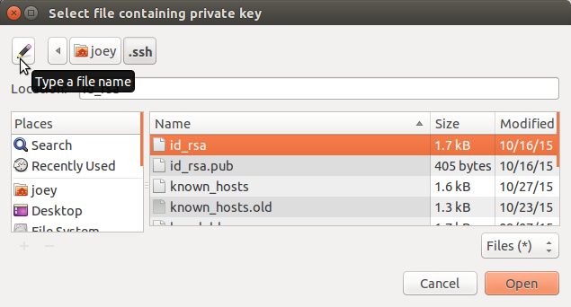
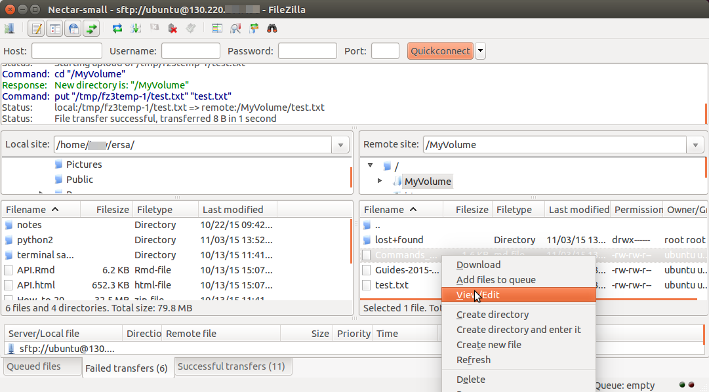

## Contents

1. [FileZilla: GUI sftp client](#filezilla)
1. [SCP: secure copy](#scp)
1. [SFTP via the command line](#sftp)

## FileZilla  

FileZilla is one of many programs that provides easy, point-and-click SFTP (secure file transfer protocol).
Not only can you easily transfer files between your local computer and your virtual machine (VM),
but you can also open and edit documents that are on your VM, using programs on your local computer.

### Download and Install FileZilla

1. For Ubuntu - Install from the Ubuntu Software Centre app
1. Mac and Windows - Download the program file [FileZilla][filezilla]
1. Double click file - follow installation instructions for Windows
1. For Mac - drag the filezilla.app file to your Applications folder.
1. Open FileZilla

### SFTP connection to the VM

- Click the menu options  
 ***FileZilla OR Edit -> Settings OR Preferences -> Connection -> SFTP***

- Click ***Add key file*** and navigate to the folder storing your SSH keys. 

- *For Mac and Ubuntu:*

  1. *The keys are in '.ssh/' which will be hidden from view. There is a button in
  the window to allow you to type the address; enter '.ssh' in the input bar).*
  1. OR, *open your terminal and *enter the command `ln -s ~/.ssh ~/ssh` to create a symbolic 
  link called 'ssh' which will appear in file lists.*
  
- Choose your private key (choose the version with '.ppk' extension if available).
 FileZilla might ask to convert the fileformat. Click OK.
 

 
1. Open  ***File -> Site Manager*** . 
1. Click ***New Site*** and give it a name. 
1. Insert the *IP address* of the instance as ***Host***
1. ***Logon Type*** is interactive
1. The user is **'ubuntu'** (or 'root' if your VM has a different operating system)
1. Click ***Connect***

### FileZilla connection

The left side of the FileZilla window will list the files of your computer.  
The right side will contain the folders and files on the VM.

Remember your primary disk (where your home directory is located) usually has very little storage space.
In the VM file list, navigate to the secondary disk '**/mnt**' or an attached volume if available (e.g. '**/MyVolume**').

  **Make sure you have made these disks writable, or you will not be able to transfer 
  data onto them.**  If you have not already done so, enter the following command/s in the console of your VM.

  `sudo chown ubuntu /mnt  `  and/or

  `sudo chown ubuntu /MyVolume  `  (If you have attached a volume to your instanced.  
  Replace '/MyVolume' with the directory in which it is mounted (mount point).   
  To check the mount point, enter `lsblk -l` or `df -hT`)

- Navigate to your data storage directory in the right side of the FileZilla screen.

- Drag and drop files and directories between your local computer and the VM.

- Right click in the file list area to:
  1. Create a directory or text file
  1. Edit a text document (you may need to adjust 
  ***FileZilla/Edit -> Settings/Preferences ->  File Editing*** to ensure documents open in your local computer's default text editor.
  1. Delete, download or rename files or directories, etc.

----

## SCP: secure copy  

SCP is a simple method for transferring files between computers. 

The basic command for Secure Copy is like a UNIX `cp`, but adding a connection to a different computer in the file path

`scp <Path_To_Source_File> <Path_to_Destination>`

### Between a local Mac/Linux and the VM

Enter the command from your local computer's Terminal app. 

To upload a file to the VM:

`scp -i ~/.ssh/Nectar_Key <local-file-path> ubuntu@NNN.NNN.NNN.NNN:<instance-file-path>`

To download a file from your VM:

`scp -i ~/.ssh/Nectar_Key ubuntu@NNN.NNN.NNN.NNN:<instance-file-path> <local-file-path>`

### Between your VM and a data storage server

If you have data stored on a remote server, you can transfer files between it and the VM through the command-line on the VM.

You will need a host address for the data storage server, and your username, plus usually a password.

`scp username@host.address.edu.au:/data/myDirectory/file.txt /mnt/data/`  
`scp /mnt/data/results.zip username@host.address.edu.au:/data/myDirectory/`

You will usually then be prompted to enter the password for your data storage.

n.b. use `scp -i path/to/key ...` if your remote server has ssh keys rather than password access.

----

## SFTP via the Command Line  

Secure file transfer is also available between the VM and remote data storage.

Enter the 'sftp' command on your VM, and you will have access to the remote host.

`sftp username@host.address.edu.au   `   - you will usually be prompted for a password.

or

`sftp -i path/to/key username@host.address.edu.au   `  - if the remote server has ssh key authentication

You are now accessing the remote data storage server, and you can navigate the files on the server
as per usual with commands like `cd` and `ls`.

The commands `get` and `put` will transfer data between the machines:

`get <remote_server_file.txt> </mnt/localVM_destination/>`

`put </mnt/localVM_destination/file.txt> <remote_directory/>`

to close the sftp connection, type `exit`.

  
[filezilla]: https://filezilla-project.org/download.php?type=client 
