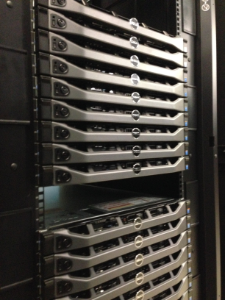

# Introduction to MonARCH

MonARCH (Monash Advanced Research
Computing Hybrid) is the next-generation HPC/HTC Cluster, designed from the
ground up to address the emergent and future needs of the Monash HPC community.

A key feature of MonARCH is that it is provisioned through R@CMon, the Research
Cloud @ Monash facility. Through the use of advanced cloud technology, MonARCH
is able to configure and grow dynamically. As with any HPC cluster, MonARCH
presents a single point-of-access to computational researchers to run
calculations on its constituent servers.

MonARCH aims to continually develop over time. Currently, it consists of 35
servers under two complementary hardware specifications:

* high-core servers - two Haswell CPU sockets with a total of 24 physical cores
  (or 48 hyperthreaded cores) at 2.80 GHz
* high-speed servers - two Haswell CPU sockets with a total of 16 physical
  cores (or 32 hyperthreaded cores) at 3.20 GHz

For data storage, we have deployed a parallel file system service using Intel
Enterprise Lustre; providing over 300 TB usable storage with room for future
expansion.

The MonARCH service is operated by the Monash HPC team and continuing technical
and operational support from the Monash Cloud team, and eSolutions
Servers-and-Storage, and Networks teams.

If you have found the MonARCH useful for your research, we will be very
grateful if you kindly acknowledge us with a text along the lines of:

> This research was supported in part by the Monash eResearch Centre and
> eSolutions-Research Support Services through the use of the MonARCH HPC
> Cluster.
