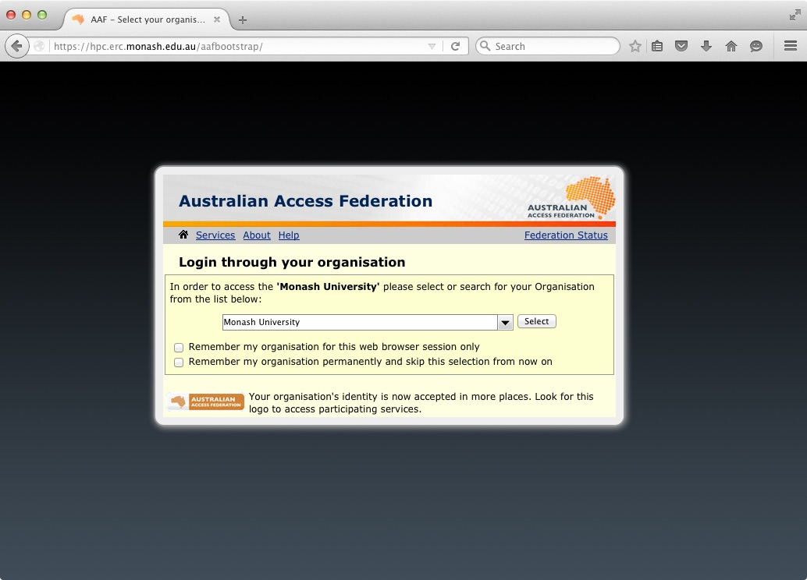
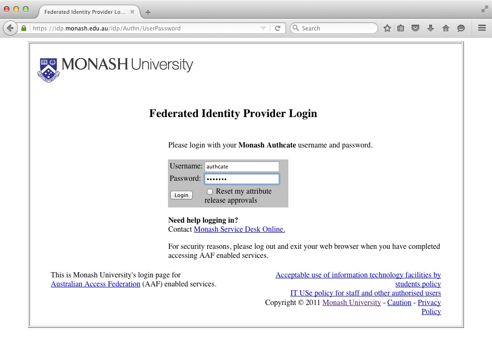
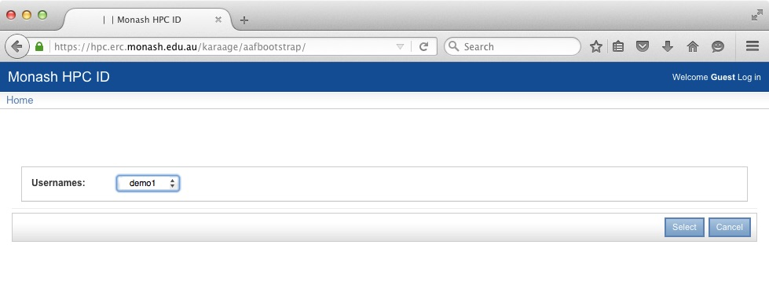
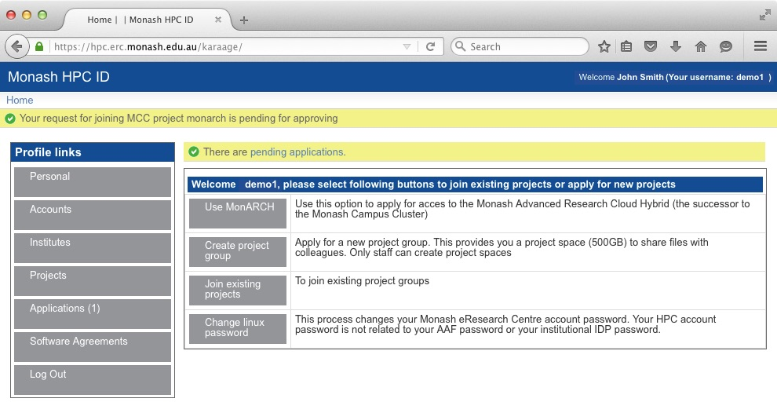

# Introduction to MonARCH


MonARCH (Monash Advanced Research
Computing Hybrid) is the next-generation HPC/HTC Cluster, designed from the
ground up to address the emergent and future needs of the research communities
supported by Monash.

A key feature of MonARCH is that it is provisioned through R@CMon, the Research
Cloud @ Monash facility. Through the use of advanced cloud technology, MonARCH
is able to configure and grow dynamically. As with any HPC cluster, MonARCH
presents a single point-of-access to computational researchers to run
calculations on its constituent servers.

MonARCH aims to continually develop over time. Currently, it consists of 35
servers under two complementary hardware specifications:

* high-core servers - two Haswell CPU sockets with a total of 24 physical cores
  (or 48 hyperthreaded cores) at 2.80 GHz
* high-speed servers - two Haswell CPU sockets with a total of 16 physical
  cores (or 32 hyperthreaded cores) at 3.20 GHz

For data storage, we have deployed a parallel file system service using Intel
Enterprise Lustre; providing over 300 TB usable storage with room for future
expansion.

The MonARCH service is operated by the Monash HPC team and continuing technical
and operational support from the R@CMon team, this includes technical
staff from both the Monash eResearch Centre and Monash eSolutions.

If you have found the MonARCH useful for your research, we will be very
grateful if you kindly acknowledge us with a text along the lines of:

> This research was supported in part by the Monash eResearch Centre and
> eSolutions-Research Support Services through the use of the MonARCH HPC
> Cluster.

## How to Access MonARCH

To access MonARCH you will need to

* Create a username and password for the Monash HPC systems
* Request access to the MonARCH resource
* Use SSH or Strudel to access MonARCH

### Apply for access to Monash HPC systems and MonARCH

1. From a web browser, visit [The Monash HPC Identity Management System](https://hpc.erc.monash.edu.au/aafbootstrap)

This web page will bootstrap your Monash HPC account using information provided
by your Institution and the AAF.

Depending on your settings, usually the next step will be to select your
institution, in this example, "Monash University".



2: You will be redirected to your institutions secure Identity Provider
service. You should enter your institutional username and password to
authenticate to your institution.  In the background, your institution will
tell us information like your Name and email address (but never your password).
Depending on your settings, you may be asked to approve your institution
telling us this information.



3: The next step is Username Selection. You will be presented with a list of
available usernames, It is important to note that this username is not
necessarily the same as your institute username. This username is for SSH and
SCP access to the MonARCH login node.

In the example below, the user's University username is "authcate" but their username
for MonARCH is "demo1".



4: Apply to access MonARCH. Select the **"Use MonARCH"** option.

This will send a request to the MonARCH team to approve access to the cluster.



The above screen-grab shows that the application is pending for approval.

The application will the go through an approval process. First the project
leader will approve the application, then the administrators will approve the
application While the approval process is ongoing, if you click on the
**"Applications"** button you should see something like this:

![Screen show of HPC ID system in waiting for admin state)(images/wait_admin.jpg)

Once the application has been approved, you'll receive an email and be able to
move onto the next step.

5: Change your MonARCH cluster password. Note that this *DOES NOT* change your
Institutional password. Choose **"Personal"** and click **"Change Password"**.

Important: This *DOES NOT* change or affect your Institutional password. This
password is for SSH and SCP access to the cluster.


### Accessing MonARCH

#### Using SSH

You will need to use ssh (secure-shell) to login to the head node. This program
encrypts your interactions with the server. How to get and use ssh depends upon
your desktop operating system.

##### Linux and MacOS

Linux and MacOS both have SSH built in. Simply open a terminal and type

> ssh *username*@monarch.erc.monash.edu.au

where *username* is the selected username from Step 3. In the above example,
the username is "demo1", so:

> ssh demo1@monarch.erc.monash.edu.au

##### Microsoft Windows

ssh is not native to Windows, but you can download several free versions. Many
Monash PCs have a version of ssh installed already on them.

###### putty

You can download putty from [the putty website](http://www.putty.org/) Once
installed you run putty:

> Start->All Programs->PuTTY->PuTTY

Select “Session:” on the left pane.

In the text box on the right pane labelled **"Host Name (or IP address)"**
enter **monarch.erc.monash.edu.au**

Click open. You will be prompted for your username and password. These are the
username and password you set for the Monash HPC ID system, not your
institutional username and password.

## SLURM

### Introduction

MonARCH uses the SLURM scheduler for running jobs.  The home page for SLURM is [http://slurm.schedmd.com/](http://slurm.schedmd.com/), and it is used in many computing systems, such as MASSIVE and VLSCI.
SLURM is an open-source workload manager designed for Linux clusters of all sizes. It provides three key functions.

* It allocates exclusive and/or non-exclusive access to resources (computer nodes) to users for some duration of time so they can perform work.
* It provides a framework for starting, executing, and monitoring work (typically a parallel job) on a set of allocated nodes.
* It arbitrates contention for resources by managing a queue of pending work.

The following material will explain how users can use SLURM.  At the bottom of the page there is a PBS, SGE comparison section.

### SLURM Glossary

It is important to understand that some SLURM syntax have meanings which may differ from syntax in other batch or resource schedulers.

| Term     | Description                                                                                               |
| -------- | ----------------------------------------------------------------------------------------------------------|
| Resource | A mix of CPUs, memory and time                                                                            |
| Task     | A task under SLURM is a synonym for a process, and is often the number of MPI processes that are required |
| Partition| SLURM groups nodes into sets called partitions. Jobs are submitted to a partition to run. In other batch systems the term queue is used |
| Account | The term account is used to describe the entity to which used resources are charged to |
| Batch jobs | A chain of commands in a script file |
| Success | A job completes and terminates well (with exit status 0) (cancelled jobs are not considered successful) |
| Failure | Anything that lacks success |
| CPUs | The term CPU is used to describe the smallest physical consumable, and for multi-core machines this will be the core. For multi-core machines where hyper-threading is enabled this will be a hardware thread. |
| Node | A node contains one or more sockets |
|  Socket | A socket contains one processor |
| Processor| A processor contains one or more cores |
|  Core | A CPU core |

### SLURM Shell Commands

Users submit jobs to the MonARCH using SLURM commands called from the Unix shell (such as bash, or csh). Typically a user creates a batch submission script that specifies what computing resources they want from the cluster, as well as the commands to execute when the job is running.  They then use sbatch *filename* to submit the job.  Users can kill, pause and interrogate the jobs they are running.  Here is a list of common commands:

#### Commands to submit/delete a job in the queue

| Command | Description |
| --- | --- |
| sbatch | sbatch is used to submit a job script for later execution. The script will typically contain one or more srun commands to launch parallel tasks. |
| scancel | Deletes a job from the queue, or stops it running. |

#### Commands to run an executable

| Command | Description |
| --- | --- |
| srun | srun should be used to execute each program in your job script. It supersedes mpirun and is capable of starting highly parallel jobs much faster than mpirun|

#### Examining and Controlling the queue

| Command | Description |
| --- | --- |
| sinfo | reports the state of partitions and nodes managed by Slurm. It has a wide variety of filtering, sorting, and formatting options.|
| squeue | reports the state of jobs or job steps. It has a wide variety of filtering, sorting, and formatting options. By default, it reports the running jobs in priority order and then the pending jobs in priority order.  |
| scontrol | Report  or modify details of a job |
| sinteractive | It is possible to run a job as an interactive session using ' sinteractive '. The program hangs until the session is scheduled to run, and then the user is logged into the compute node. Exiting the shell (or logging out) ends the session and the user is returned to the original node. |

#### Viewing job metrics

| Command | Description |
| --- | --- |
| sacct | The command sacct shows metrics from past jobs. |
| sstat | The command sstat shows metrics from currently running jobs when given a job number. Note, you need to launch jobs with srun to get this information. |

### More on Shell Commands

Users have several ways of getting information on shell commands.

* The commands have man pages (via the unix manual). e.g. man sbatch
* The commands have built-in help options, e.g. sbatch --help or sbatch --usage.
  * help print brief description
  * usage  prints list of options
* There are online manuals and information pages

Most commands have options in two formats:

* single letter e.g. -N 1
* verbose  e.g. --nodes=1

Note the double dash -- in the verbose format. A non-­‐zero exit code indicates failure in a command.

#### Some default behaviours

* SLURM processes launched with srun are not run under a shell, so none of the following are executed:
  * ~/.profile
  * ~/.baschrc
  * ~/.login
  * ~/.cshrc, etc
* SLURM exports user environment by default (or --export=NONE)
* SLURM runs in the current directory (no need to cd $PBS_O_WORKDIR)
* SLURM combines stdout and stderr and outputs directly (and naming is different). The SLURM stdout /stderr file will be appended,not overwritten (if it exists)
* SLURM is case insensitive (e.g. project names are lower case)
* Use #SBATCH instead of #PBS in batch scripts

### Batch Scripts

A job script has a header section which specifies the resources that are
required to run the job as well as the commands that must be executed. An
example script is shown below.

```bash
#!/bin/bash

#SBATCH --job-name=example
#SBATCH --account=director100
#SBATCH --partition=workq
#SBATCH --time=01:00:00
#SBATCH --ntasks=32
#SBATCH --ntasks-per-node=16
#SBATCH --cpus-per-task=1
#SBATCH --export=NONE

module load intel
uname -a
srun uname -a
```

Here are some of the SLURM directives you can use in a batch script.

| SLURM directive | Description |
| --- | --- |
--job-name=[job name] | The job name for the allocation, defaults to the script name.
--account=[account name] | Charge resources used to this account. A default account is configured for each user.
--partition=[partition name] | Request an allocation on the specified partition. If not specified jobs will be submitted to the default partition.
--time=[time spec] | The total walltime for the job allocation.
--array=[job spec] | Submit a job array with the defined indices.
--dependency=[dependency list] | Specify a job dependency.
--nodes=[total nodes] | Specify the total number of nodes.
--ntasks=[total tasks] | Specify the total number of tasks.
--ntasks-per-node=[ntasks] | Specify the number of tasks per node.
--cpus-per-task=[ncpus] | Specify the number of CPUs per task.
--ntasks-per-core=[ntasks] | Specify the number of tasks per CPU core.
--export=[variable\|ALL\|NONE] |  Specify what environment variables to export.

NOTE: SLURM will copy the entire environment from the shell where a job is
submitted from. This may break existing batch scripts that require a different
environment than say a login environment. To guard against this --export=NONE
can be specified for each batch script.

## MonARCH Hardware Summary

There are two classes of compute nodes on MonARCH. They are broken into "High
Speed" and "High Core Count" flavours.

* config A: high-ish CPU clock speed, lower-core count, standard RAM

  * 16 physical cores or 32 HT cores ==> two Intel Xeon E5-2667 v3 3.2GHz, 20M
    Cache, 9.60GT/s QPI, Turbo, HT, 8C/16T (135W)
  * 128 GB RAM == 8 x 16GB RDIMM, 2133 MT/s, Dual Rank, x4 Data Width
* config B: lower CPU clock speed, high-core count, higher RAM
  * 24 physical cores or 48 HT cores ==> two Intel Xeon E5-2680 v3 2.5GHz, 30M
    Cache, 9.60GT/s QPI, Turbo, HT, 12C/24T (120W)
  * 256 GB RAM == 16 x 16GB RDIMM, 2133 MT/s, Dual Rank, x4 Data Width

MonARCH supports a wide range of software  packages. The Linux environment module utility is used to load and unload different software packages. When a module is loaded, it sets specific environment variables (e.g., PATH, LD_LIBRARY_PATH, etc.) to the appropriate pathnames where the software is installed.

## Environment Modules

 There may be occasions where you need to use different compilers and/or libraries from those found in your usual environment, and you therefore need to adjust your environment variables accordingly. The module command makes this easy. Some examples of its use are:

| module avail | Shows what modules are available on the system |
| --- | --- |
| module whatis | Shows what they do |
| module load openmpi-intel | Makes Intel MPI libraries and Intel Fortran compiler available |
| module list | Shows which module are loaded |
| module purge | Unloads all of them |
| module unload openmpi-intel intel | Unloads Intel MPI and Intel Fortran modules |
| module display [modulefile]Software | Use this command to see exactly what a given modulefile will do to your environment, such as what will be added to the PATH, MANPATH, etc. environment variables. |

Here is an example of how to load the GNU C/C++ compiler.

```bash

$module load gcc/4.3.5
```

That's all! Now here we put some extra Linux commands to show that, by loading
the module, we override the default System compiler.

Load the gcc compiler, showing paths and versions:

```bash
#
# show that we have the default compiler
#
$which gcc
/usr/bin/gcc
$gcc -v
Using built-in specs.
Target: x86_64-redhat-linux
Configured with: ../configure --prefix=/usr --mandir=/usr/share/man
--infodir=/usr/share/info
--enable-shared --enable-threads=posix --enable-checking=release
--with-system-zlib --enable-__cxa_atexit
--disable-libunwind-exceptions --enable-libgcj-multifile
--enable-languages=c,c++,objc,obj-c++,java,fortran,ada
--enable-java-awt=gtk --disable-dssi --enable-plugin
--with-java-home=/usr/lib/jvm/java-1.4.2-gcj-1.4.2.0/jre
--with-cpu=generic --host=x86_64-redhat-linux
Thread model: posix
gcc version 4.1.2 20080704 (Red Hat 4.1.2-46)
#
# load a different compiler
#
$module load gcc/4.3.5
#
# check that we have a new version
#
$which gcc
/opt/sw/gcc-4.3.5/bin/gcc
$gcc -v
Using built-in specs.
Target: x86_64-unknown-linux-gnu
Configured with: ../gcc-4.3.5/configure --prefix=/opt/sw/gcc-4.3.5
Thread model: posix
gcc version 4.3.5 (GCC)
```

Suppose we wanted to know more about a module we wanted to load? That can be done via the 'show' command 'module show' example

```bash
module show gcc/4.3.5

-------------------------------------------------------------------
/opt/sw/Modules/modulefiles/gcc/4.3.5:
module-whatis    GNU Compiler Collection is ...
conflict     gcc/4.8.0
conflict     gcc/4.4.4
conflict     gcc/4.5.3
conflict     intel/10.0.025
conflict     intelC/10.0.025
prepend-path PATH /opt/sw/gcc-4.3.5/bin:/opt/sw/gcc-4.3.5/libexec/gcc/x86_64-unknown-linux-gnu/4.3.5
prepend-path     LD_LIBRARY_PATH /opt/sw/gcc-4.3.5/lib64:/opt/sw/gcc-4.3.5/lib
prepend-path     MANPATH /opt/sw/gcc-4.3.5/man
-------------------------------------------------------------------
```

Suppose we wanted to use the system compiler again. All you do is unload the module.
Unload the gcc compiler

```bash
module unload gcc/4.3.5

```

Here we unload the compiler, checking that we have the right versions when finished.

Check that we load the correct compiler:

```bash
#
# unload compiler
#
$ module unload gcc/4.3.5
#
# show that we have the default compiler
#
$which gcc
/usr/bin/gcc
$gcc -v
Using built-in specs.
Target: x86_64-redhat-linux
Configured with: ../configure --prefix=/usr --mandir=/usr/share/man --infodir=/usr/share/info --enable-shared --enable-threads=posix --enable-checking=release --with-system-zlib --enable-__cxa_atexit --disable-libunwind-exceptions --enable-libgcj-multifile --enable-languages=c,c++,objc,obj-c++,java,fortran,ada --enable-java-awt=gtk --disable-dssi --enable-plugin --with-java-home=/usr/lib/jvm/java-1.4.2-gcj-1.4.2.0/jre --with-cpu=generic --host=x86_64-redhat-linux
Thread model: posix
gcc version 4.1.2 20080704 (Red Hat 4.1.2-46)
```

An advantage of using the module command is that it warns you about conflicting packages.  You can't load two different gcc compilers at the same time!

```bash
$ module load gcc/4.3.5
$ module load gcc/4.2.3
gcc/4.2.3(15):ERROR:150:    Module 'gcc/4.2.3' conflicts with the currently loaded module(s) 'gcc/4.3.5'
gcc/4.2.3(15):ERROR:102:    Tcl command execution failed: conflict gcc/4.3.5
```

Note. Some modules load other modules! Also, if the software is licensed,
loading a module does not mean you will be allowed access to it.  Please  email
mcc-help@monash.edu to gain access to proprietary software. Here, loading the
vasp module will not allow you access to it.

Example of 'module list':

```bash
module list
Currently Loaded Modulefiles:
  1) gcc/4.3.5               3) mpfr/2.4.2              5) openmpi/1.6-gcc-4.5.3   7) vasp/5.3.2-2D
  2) gmp/4.3.2               4) mpc/0.9                 6) fftw/3.2.2-openmp
```

If you do not explicitly give a version number, module will use the default module.

Example of 'module display'

```bash
module display gcc
-------------------------------------------------------------------
/opt/sw/Modules/modulefiles/gcc/4.4.4:


                module-whatis     GNU Compiler Collection is ...
                module         load gmp mpfr
                conflict     gcc/4.8.0
                conflict     gcc/4.3.5
                conflict     gcc/4.5.3
                conflict     intel/10.0.025
                conflict     intelC/10.0.025
                prepend-path    PATH/opt/sw/gcc-4.4.4/bin:/opt/sw/gcc-4.4.4/libexec/gcc/x86_64-unknown-linux-gnu/4.4.4
                prepend-path    LD_LIBRARY_PATH /opt/sw/gcc-4.4.4//lib64
                prepend-path    MANPATH /opt/sw/gcc-4.4.4//man
                -------------------------------------------------------------------
```

This is the output of 'module avail'.  You can interrogate any module with the commands listed above.
Output of 'module avail'

```bash
module avail
------------------------------ /usr/share/Modules/modulefiles -------------------------------
dot                    matlab-compiler/R2011a module-info            null
matlab/R2011a-local    module-cvs             modules                use.own

------------------------------ /opt/sw/Modules/modulefiles ----------------------------------
FEniCS/1.0                         fluent/proto                       libctl/3.0.3(default)
Mesa/7.0.1(default)                freeglut/2.6.0                     libctl/3.1
Mesa/7.0.2                         freeimage/3.13.1                   libctl/3.2.1
Mesa/7.2                           freesurfer/5.0.0                   libxc/2.0.2
OpenBUGS/3.1.1                     fsc/1.1.2                          libxml2/2.7.2
OpenCV/2.2.0                       fsl/4.0.2                          macmolplt/7.4.2
Qt/3.3.8b                          fsl/4.1.0-test                     mallet/2.0.7
Qt/4.2.3                           fsl/4.1.5                          ...
...
```
