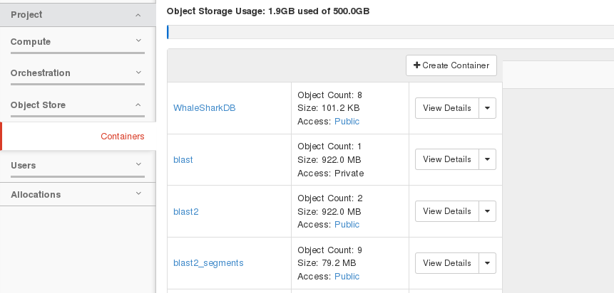
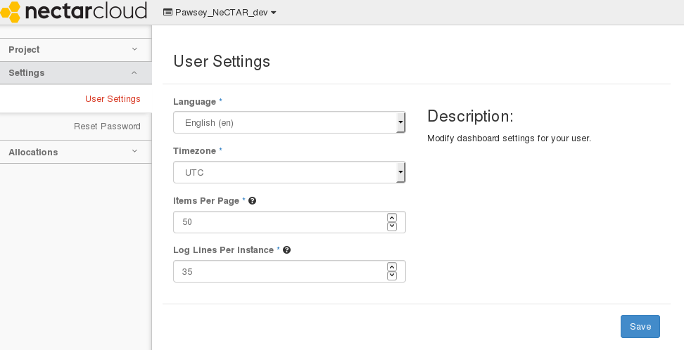

 <a name="top"></a>

# Bioinformatics using the Cloud Storage with NCBI data

## Table of Contents

- [Introduction](#intro)
- [NeCTAR Research Cloud storage components review using the OpenStack Dashboard](#dashboard)
- [Attached Storage](#attached)
  - [root disk](#root)
  - [ephemeral](#ephemeral)
- [External Storage - Volume and Object](#external)
  - [What is volume or block-storage](#volume)
  - [What is object storage](#object)
- [File I/O best practices](#io)
- [Using the Openstack APIs to Manage NCBI Data](#openstack)
- [Downloading NCBI datasets directly to your instance](#ncbi)
- [Summary](#summary)

[Top of page](#top)
<a name="intro"></a>

## Introduction

This guide is a reference on how to easily utilize all the different storage
components of the NeCTAR into a bioinformatics framework so that you can work
more efficiently. For the puposes of developing our framework will use the
[NCBI-BLAST+](http://blast.ncbi.nlm.nih.gov/Blast.cgi) as it is a popular
application across many areas of bioinformatics. The BLAST data sets can be
very large and that present challenges to store and access that data locally
making it difficult to implement in the NeCTAR research clould.

[Top of page](#top)

<a name="dashboard"></a>

## NeCTAR Research Cloud storage components review using the OpenStack Dashboard

The NeCTAR is a federated research cloud that uses OpenStack as the cloud
operating system it controls the compute, storage and networking resources
across the different zones that make up the research cloud. The OpenStack
dashboard lets user `provision` resources for their instances through a web
interface. The storage resources can be classified as attached and external disks
each of which has different purpose that needs some basic explanation.

<a name="attached"></a>

### Attached storage

With your instance you have access to limited diskspace with the "root disk"
partition "/" and "ephemeral disk" partition that is accessed via the /mnt
directory of the default NeCTAR images. The size of the the "root disk" and
"ephemeral disk" varies with the different hardware templates or [flavors]
(https://support.nectar.org.au/support/solutions/articles/
6000055380-resources-available-to-you) that are available when you are
configuring your instance. So understanding your research data requirements
is key so you can select the correct `flavor` for your instance. However,
as with everything including the research cloud it does require a bit more
insight of how a research might make the best use of these storage components in
a bioinformatic workflow. Fortunately, NeCTAR is a the ideal resource to allow
researchers to improve their technical knowledge of to how to use the research
cloud for their computational work.

[Top of page](#top)
<a name="root"></a>

### What is the root disk

The root disk is an ephemeral disk that the operating system (OS) image is
copied to when you launch a virtual machine. It is also where your home
directory is located in you virtual machine. When you snapshot your instance it
is what is copied to create your snapshot image.

[Top of page](#top)
 <a name="ephemeral"></a>

### What is ephemeral disk

Ephemeral is a secondary ephemeral data disk. That is an empty disk and exists
only for the life of the instance. When you terminate an instance all data in
ephemeral is lost. With the NeCTAR default images that have ephemeral storage
are mounted with the instance and located at `/mnt` but you will need to change
the ownership of the `/mnt` directoryto be able to have read/write access to do
this on a ubuntu instance use:

`$ sudo chown ubuntu /mnt`

on a fedora, centos, scientific linux instances

`$ sudo chown ec2-user /mnt`

and on a debian instance.

`$ sudo chown debian /mnt`

This ephemeral disk space is where you should run you analysis as your `home`
directory is too small.

[Top of page](#top)

<a name="external"></a>

## External Storage - Volume and Object

When you apply for a NeCTAR [allocation](https://dashboard.rc.nectar.org.au) you
are able to apply for object and volume storage to use for research project.


Assuming that your allocation request has either volume or object storage or
both when you configure your volume or object storage you need to remember to do
select a sensible [availability zones](https://support.nectar.org.au/solution/
articles/6000055381-availability-zones ) to use with your data.

 <a name="volume"></a>

### What is volume or block-storage

Persistent [block-storage](http://docs.openstack.org/openstack-ops/content/
user_facing_block_storage.html) or volume storage can live outside of you
instance. This means that you read and write data in the persistent volume
storage and it can be moved around to different instances but can only be
mounted to one instance at any given time. You can find more information about
creating and attaching persistent volumes through the NeCTAR dashboard on the
NeCTAR [support](https://support.nectar.org.au/solution/articles/
6000055382-introduction-to-cloud-storage) page. Once it is attached to an
instance the dashboard will show what the this:


note the volume names are hyperlinks that show the volume overview,


The Attachments show what device the that the volume is attached to in
the is case

`/dev/vdd`

where `/dev` is the name of the device files and `/vd*` is the name of
the virtuo block device.

The important commands to that you need to know to configure the persistent
volume storage once you have attached to your instance. For most NeCTAR
research cloud users an ext4 filesystem is more than sufficient and the
different filesystems are beyond the scope of this document.

To to create an ext4 filesystem on the device or persistent volume use

`$ sudo mkfs.ext4 /dev/vdd`

WARNING: You only need to do this once as this reformats the device any
data on the device will be lost!

Create a directory to mount the volume to it can be anything but should be
meaningful and consistent for your work.

`$ sudo mkdir /volume_data`

To mount the persistent volume the command is:

`$ sudo mount /dev/vdd /volume_data -t auto`

Lastly you will need to change the ownership of the `/volume_data` directory to
be able to have read/write access to do this on a ubuntu instance use:

`$ sudo chown ubuntu /volume_data`

on a fedora, centos, scientific linux instances

`$ sudo chown ec2-user /volume_data`

and on a debian instance.

`$ sudo chown debian /volume_data`

To unmount the volume from your instance use these command `umount`
NOTE: Do not umount the device if you are in that directory so `cd` to your
home directory first otherwise you it will fail.
`$ cd`
`$ sudo umount /volume_data`

[Top of page](#top)
<a name="object"></a>

### What is object storage

What is object storage?


A more useful definition can be found on the NeCTAR [support]
(https://support.nectar.org.au/solution/articles/
6000055382-introduction-to-cloud-storage) page.

From the NeCTAR dashboard you can create `containers` in the Object Store.



click the create container button


Fill in the Container name and the click the create container button. You can
then choose if you want to make the object container public or private.


The private objects are only available within your NeCTAR project. While object
in public containers are exactly as the note states in the window when you
created your container


It is available to anyone that knows the URL to that object including users
who don't have access to NeCTAR instances.

You can upload object data from you local computer to the container using the
dashboard just select the `Upload Object` button. To download an object to your
local computer just select the `Download` button.


To download the object to your instance you just neeed to use `wget`

`wget https://dashboard.rc.nectar.org.au/project/containers/blast/wgs.99.tar.gz`

[Top of page](#top)
<a name="io"></a>

## File I/O best practices

Moving data to and from you instance instance depending on the size of the files
your are try to move can be trival for small data but large data sets can become
very difficult depending on many different things. Here are some things to keep
in mind with data I/O and the cloud.

- Compress your data files if they are larger than 10Mb with [**gzip**](http://www.math.utah.edu/docs/info/gzip_4.html#SEC7) or some other compression tool it should be installed in your instance.

- If you have to move a directory create [**tar**](https://www.cs.colostate.edu/helpdocs/tar.html) files.

- Don't try to move data over a wireless network, plugin to an ethernet connection, preferably at your local institution they have larger bandwidth.

- If you data move still time out or are getting throttled contact your the local institutes IT support to see if they can help.

- Ohio-(Only handle it once) if you are uploading data to your instance try to move it directly to your instance, NeCTAR is on a fast networks as most nectar nodes are housed within University or HPC data centers.

With smaller data you can try any of the methods coverd on the NeCTAR ([support]
(https://support.nectar.org.au/support/solutions/articles/
6000085114-transferring-data-to-your-vm)) page it has excellent instructions.
This will work for moving data to and from your ephemeral or volume storage
attached to your instances.

[Top of page](#top)
<a name="openstack"></a>

## Using the OpenStack APIs for Managing NCBI Data

The National Center for Biotechnology Information ([**NCBI**]
(http://www.ncbi.nlm.nih.gov/)) is located in Bethesda, Maryland and hosts the
Basic Local Alignment Search Tool ([**BLAST**]
(http://blast.ncbi.nlm.nih.gov/Blast.cgi)) data and is available directly from
the NCBI FTP site `ftp://ftp.ncbi.nlm.nih.gov`. It is necessary for researchs
to be able to access these data sets easily as they are required for many
different Bioinformatic tools specifically BLAST. However we will not present
how to actually run BLAST but how to manage the NeCTAR reseach cloud storage
resources to enable researchers to utilize the NCBI BLAST data sets effectively.

### Install the Python client tools

First you will need to update your instance and install a set of packages that
support the OpenStack APIs.These are the commands for a ubuntu instance.

```$ sudo apt-get update```

```$ sudo apt-get install python-novaclient```

```$ sudo apt-get install python-keystoneclient```

```$ sudo apt-get install python-cinderclient```

```$ sudo apt-get install python-swiftclient```

[Top of page](#top)

### Configuring your instance to use the Openstack API

This the basic procedure to configure within your instance to use the OpenStack
APIs with the Python clients. The first step is to set or reset your your
password from the OpenStack dashboard through your user account settings.


Select the Reset Password tab:



that takes you to the Password Reset Form where you reset your password


This is your new password it is case sensitive. We will use this in the
OpenStack RC file.


From the OpenStack dashboard under the Compute -> Access & Security, select the
`Download OpenStack RC File` that will automatically download a RC-file to your
local machine.


The OpenStack RC File that you just downloaded will have the name
Project_name-openrc.sh You will need to edit the following lines in the
Project_name-openrc.sh file.


So that the new password is hardcoded into the Project_name-openrc.sh file.


You will need to the copy that file and your ssh key file either the ssh
**pem file** or the ssh **key** file that is associated with your instance from
your local machine to your instance. Using any of the method described in
NeCTAR [support](https://support.nectar.org.au/support/solutions/articles/
6000085114-transferring-data-to-your-vm)
documents. You should move your key file or pem file to your `.ssh` directory
in your home directory on your instance.

On your instance you will need to source the Project_name-openrc.sh file to
configure your environment to authenticate access to the OpenStack services.

`$ source Project_name-openrc.sh`

You will need to source the script before you can run any of the commands
otherwise the environment is not set properly.

note: If you see this


you forget to source the OpenStack RC file.

If you source your OpenStack RC file and see this:


You did not edit the OpenStack RC file!

### Testing you API authentication

To test your access authentication you can use the command

`$ nova list`

this should show the list of your current instances that indicates your
authentication access was successful!


[Top of page](#top)
<a name="ncbi"></a>

### Downloading NCBI datasets directly to your instance

The data transferring program listed NeCTAR
[support](https://support.nectar.org.au/support/solutions/articles/
6000085114-transferring-data-to-your-vm) documents
work nicely from your local computer but can be difficult to implement in
the cloud because of gui's or poor performance. What we need is a program to
allow us to download from the NCBI ftp site directly to our instance's
ephemeral or volume storage that works from the commandline.

NCBI has had good success with the [**lftp**](http://lftp.yar.ru/desc.html)
program available from the image packages repository has shown to work nicely
from the UNIX/Linux commandline. To install it to your instance you can just
use the package managment tools for ubuntu the command is:

`$ sudo apt-get install lftp`

you can then use the `lftp` command

`$ lftp ftp.ncbi.nlm.nih.gov`

Then you can use the same `ftp` commands to navigate between the local and
remote systems and download with `get` and upload with `put`. This figure
shows how simple this process is to get to the blast datasets


Now you can use get to download the data to your instance directly.

### Using the swift API create a new container

To list all the containers in your project.

`$ swift list`

To create a new **private** container with the swift API from the command line

`$ swift post container_name`

To create a new **public** container the swift API use:

`$ swift post -r .r:* container_name``

To upload the data into the container.

`$ swift upload 'container_name' 'data_file'`


To see your new container

`$ swift list`

and the objects in your new container

`$ swift list 'container_name'`


[Top of page](#top)
<a name="summary"></a>

## Summary

We have covered the difference between root, ephemeral, volume and object
storage available through the NeCTAR research cloud and what programs are
used to be able to store you data correctly so that you can make effective
use of you virtual machine.

- The root storage is for the Operating system and you home directory. You
  should install all applications there and your home directory is should
  not store any data but small scripts and files.

- The ephemeral storage is your workspace so all of you analysis should be
 done there and you can store your local data there. Remember to get the
 right size hardware flavor.  It needs to have enough disk space for
 analysis to run and store any associated data.  It is your responsibilty
 to maintain and will require regular housekeeping.  Please ***delete***
 files that are not needed and move important results back to either your
 local machine or to volume/object storage to share them with your group or
 the world.

- The volume storage can be used for storing results, working
data, or as a working directory if needed. If you have multiple
researcher who have access to your project then you can share
data via the volume storage.  It is also possible to attach more
that one volume storage instance to your compute instance as
well so you can one for input data and have a second for results.

- The object storage should be used for static datasets
  either reference ones like the NCBI-BLAST data sets or
  analysis results you wish to sharewith collaborators.
  Static data can be downloaded easly to your volume or
  ephemeral storage as part of you workflow or pipeline.
  With an original copy in object storage you can delete
  it from either volume or ephemeral storage then with
  out having to get a new copy to your instance.

NOTE: There are some unresolved issues with uploading large
data sets (>5GB) in to object storage.
Understanding how to split/merge files that are larger than
5GB and being able to manage them easily.

[Top of page](#top)
