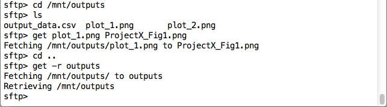

----

## Table of Contents

- [Introduction](#Intro)
- [Installing R](#R)
  - [Updating to the newest version of R](#Updating)
- [Installing RStudio Server GUI](#RStudio)
  - [Troubleshooting and server management](#Troubleshooting)
- [Installing and switching between multiple versions of R](#multiple versions)
  - [Using RStudio under multiple versions of R](#RStudio multiple versions)
- [Transferring files between your local and remote systems](#Transfer files)
  - [Transferring files to your remote instance](#to)
  - [Transferring files from your remote system](#from)
- [Installation and management of R packages](#R packages)
- [Running R in the cloud](#Running R)

----

## Introduction 

This documentation provides a step-by-step guide for installing and configuring a ready-to-use R environment, and optional RStudio Server graphical user interface, within the NeCTAR Research Cloud. Beyond basic software installation and version management, information is also provided for how to import and export data to and from your cloud instance as well as guidance for how to actually run R in the cloud. The commands are relevant for Ubuntu and Debian users and were tested on a Mac and PC, through MobaXterm virtual Linux emulator.

There is an assumption that the user already has a basic understanding of Linux command line coding and is familiar with the NeCTAR Research Cloud (i.e. setting up ssh-keypairs and launching and logging into instances, etc.). However, guidance is provided throughout if experience is limited. Security and maintenance of NeCTAR cloud instances are the responsibility of the user, although some support is provided by the [NeCTAR Helpdesk](https://support.rc.nectar.org.au/docs/support) as well as extensive documentation available for using [NeCTAR](https://support.rc.nectar.org.au/docs/getting-started).

----

## Installing R 

R is available for installation in many Linux distribution package repositories, including the most commonly used Ubuntu and Debian operating systems. To install the default version of R and dependent packages for the distribution you are using, perform these commands in your terminal window:

`$ sudo apt-get update`  
`$ sudo apt-get install r-base`   
`$ R`  
`>`  

Your terminal window is now your R console.

### updating to the newest version of R 

As new versions of R are released more regularly than versions of operating systems are, your Linux distribution will not always have the newest, or required, version of R in its software package repository. To install the newest version of R you will need to add the repository address to your package sources file so it will be downloaded when you perform a system update.

`$ sudo nano /etc/apt/sources.list`

Note: nano is a text editor, but you can use other similar editors. To install nano:

`$ sudo apt-get install nano`

The command will open your sources.list file and allow you to perform edits to it. The address you add will depend on both your preferred [CRAN mirror](https://cran.r-project.org/mirrors.html) and the specific [Linux distribution](https://cran.rstudio.com/bin/linux/) you are using. 

`deb http://<cran.mirror>/bin/linux/<OS type and version>`

You will then need to obtain and add the appropriate public key:

The **Ubuntu** archives on CRAN are signed with the key of "Michael Rutter" with key ID E084DAB9. You can fetch and add this key with:

`$ sudo apt-key adv --keyserver keyserver.ubuntu.com --recv-key E084DAB9` 

The **Debian** archives on CRAN are signed with the key of "Johannes Ranke" with key ID 381BA480. You can fetch and add this key with:

`$ sudo apt-key adv --keyserver keys.gnupg.net --recv-key 381BA480`  

Now perform an update to install the most recent version of R:

`$ sudo apt-get update`  
`$ sudo apt-get install r-base`  
`$ R`     
`>`  

----

## Installing RStudio Server GUI 

RStudio Server can be installed on Debian (8+) or Ubuntu (12.04+) systems. 
For installation guidelines for other distributions reference the [RStudio Server website](https://www.rstudio.com/products/rstudio/download-server/). 

In the cloud, RStudio is accessed via your web browser using your instance's IP address and a unique username and password to authenticate users. By default RStudio Server uses port 8787. If your instance's current security group rules do not allow for connections across this port you can change this in your NeCTAR Dashboard. To add this rule go to the **Access & Security** tab from the left hand toolbar and select **Manage Rules** and then **Add Rule**, for the relevant security group. In the pop-up window, create a new **Custom TCP Rule** and add port **8787**. 

Before you can connect to your RStudio Server you must download and install the package from within your terminal window. 

Note: installation of .deb files requires prior installation of package gdebi-core:

`$ sudo apt-get install gdebi-core`

Next, download and install your preferred RStudio package (Check [RStudio](https://www.rstudio.com/products/rstudio/download-server/) for an updated version):

**64bit**  
**Version: 0.99.489**

`$ wget https://download2.rstudio.org/rstudio-server-0.99.489-amd64.deb`

`$ sudo gdebi rstudio-server-0.99.489-amd64.deb`

**32bit**  
**Version: 0.99.489**

`$ wget https://download2.rstudio.org/rstudio-server-0.99.489-i386.deb`

`$ sudo gdebi rstudio-server-0.99.489-i386.deb`

Now that RStudio Server is installed, you can access the server from your local web browser, specifying your instance's IP address and the RStudio Server default port. 

`http://<IP address>:8787`

If you get this in your browser, RStudio Server was successfully installed. To be able to log-in to RStudio, you will need to create a new user account in your instance using this command:

`$ sudo adduser <username>`

This new user account will be separate from your NeCTAR instance log-in, i.e. the default administrator (ubuntu/debian) and associated keypair, meaning it alone cannot be used to ssh into your remote system. To allow this new user access to ephemeral storage (/mnt) you will need to change its permissions.

***Reminder:*** your ephemeral storage (/mnt) can be thought of as your cloud 'workspace' since it contains the greatest amount of memory. This is where you should store data and run scripts to avoid filling up your home directory. By default ubuntu/debian do not have permissions for this directory; if you have not already changed your permissions for /mnt perform the following command:
`$ sudo chown ubuntu`. For more information on this topic visit [NeCTAR Support](https://support.nectar.org.au/support/solutions/articles/6000055382-introduction-to-cloud-storage). 
 
`$ sudo usermod -a -G ubuntu <username>`

Now, this new username and password can be used to login to RStudio Server. You can access /mnt by selecting **[...]** at the top right of the **Files** tab, and upload or export between your local system and /mnt using **Upload** and **More** -> **Export...**.

### troubleshooting and server management 

The following commands are useful for management of your RStudio Server, and for troubleshooting installation and server access issues. For further information see the [RStudio Server Administrator's Guide](https://s3.amazonaws.com/rstudio-server/rstudio-server-pro-0.98.507-admin-guide.pdf).

Tests correct installation and connection with installed R:  
`$ sudo rstudio-server verify-installation`

Restarts RStudio after changes or updates are made:  
`$ sudo rstudio-server restart`

Returns current status:  
`$ sudo rstudio-server status`

Takes system online or offline:  
`$ sudo rstudio-server online`
`$ sudo rstudio-server offline`

Views system log, filtering for RStudio:  
`$ more /var/log/syslog | grep RStudio`

----

## Installing and switching between multiple versions of R

Older versions of R must be built from their source code. The easiest way to manage multiple versions of R within your instance is to create a special directory in which to hold and configure these files. For example:

`$ mkdir R.versions`    
`$ cd R.versions`    
`~/R.versions$`  

To install any compatible version of R from source you first need to obtain the build dependencies:

`$ sudo apt-get build-dep r-base`

Next, **within** this new directory, [obtain](https://cran.rstudio.com/src/base) and unarchive the source code for the version of R you require. The example here will install R 3.2.2:

`$ wget https://cran.rstudio.com/src/base/R-3/R-3.2.2.tar.gz`

Unpack the file:

`$ tar -xvzf R-3.2.2.tar.gz`
 
Now from **within** the extracted directory, configure and install R from source. 
Note: Defining the prefix to a specific path is required to allow RStudio to find the relevant directory and shared libraries must be enabled for RStudio to access them.

`$ ./configure --prefix=/local/bin/R-3.2.2 --enable-R-shlib`  
`$ make`

R can be run at this point, without being fully installed, by executing the following command from within the directory where R-3.2.2 was configured:

`$ bin/R`  
`>`  

However, for RStudio to run you will need to perform a full installation:

`$ sudo make install`	

Other optional commands:

`$ more INSTALL`  -> reads installation guide  
`$ make check`	-> checks installation built correctly  
`$ make pdf`		-> writes PDF manuals  
`$ make info`		-> writes info files

Note: to go back to using the default version of R, you use the same command (within any directory) as prior to installing the additional version (`$ R`).

### using RStudio under multiple versions of R 

At this point RStudio is ready to run under any installed version of R- you only need to specify which version to run in the configuration file, adding a line to the file which indicates the directory for RStudio to use.

`$ sudo nano /etc/rstudio/rserver.conf`

The line you add will depend on the path you specified when R was configured and the version of R:

`rsession-which-r=/local/bin/R-3.2.2/bin/R`

Next, restart RStudio to allow the changes to take effect:

`$ sudo rstudio-server restart`

Note: you may also need to quit your current RStudio session in your browser: **File** -> **Quit RStudio** (which will reopen a new session). Then, type this command in your R console to confirm the appropriate version is running.

`> R.version.string`  
`[1] "version 3.2.2 (2015-08-14)"`  

----

## Transferring files between your local and remote systems 

How you transfer files in and out of your instance will depend on a number of factors, including where your input data is stored and how much of it there is, and whether you are using R through your terminal window or RStudio Server in your web browser. If you are using RStudio you already have a direct connection from your local computer to your instance to facilitate file transfers. If you are using R through your terminal window there are a couple options for this ([See NeCTAR Support](https://support.nectar.org.au/support/solutions/articles/6000085114-transferring-data-to-your-vm)). This section will provide a short overview for transferring files via SFTP, or Secure File Transfer Protocol.

For information on how to attach **NeCTAR Volume** or **Object** storage see additional [NeCTAR Tier 0 Documentation](https://support.nectar.org.au/support/solutions/articles/6000055382-introduction-to-cloud-storage)

SFTP is related to SSH (secure shell) as it uses the same key-pair you generated to initially log into your instance, to create a secure connection for transferring files. To initialise a SFTP link between your computer and remote instance you use a similar command as when using SSH. The prompt you see when the connection has been established is similar to the R console command line.

`$sftp -i ~/directory/key_name.key ubuntu@<IPaddress>`    
`sftp>`  

The commands you use under SFTP are essentially the same standard Linux commands used for navigating and managing file systems when SSH'd into your instance. Some differences include that you must specify when you want to refer to your local directory by placing a '`l`' or an '`!`' before each command, and that the SFTP prompt does not change based on what directory you are in.

First, check your current local and remote directories

`> pwd`  
`> lpwd`  

Now, navigate through your local and remote file systems to the appropriate directories where your files are currently stored and where you would like them to be moved to, using the following common Linux commands (alternatively you can specify directory within the transfer command). 

|**Remote instance**|**Local computer**|**Command use**|  
|-------------------|------------------|:---------------|
|ls | lls | lists all visible files in current directory|
|ls -al | lls -al | lists visible and hidden files in current directory|
|cd | lcd | changes directory|
|mkdir | ! mkdir | creates new directory|  

### transferring files to your remote instance 

To transfer data files, scripts, or entire directories from your local terminal, the command `put` is used. Here is an example showing how to transfer an individual csv file. 

`> put data.csv`

To transfer an entire directory you will need to first create a destination directory with the same name.

`> mkdir R_scripts`   
`> put -r R_scripts`  

### transferring files from your remote system 

When transferring files from your remote instance, the command `get` is used. Note: you can change a file/directory name by specifying a new name at the end of the command, and if names contain spaces they must be enclosed in ' '. 

`> get <file_name> <new_file_name>`    

`> mkdir <directory>`  
`> get -r <directory>`  

To terminate your SFTP connection use the same command as when connected through ssh:

`> exit`

----

## Installation and management of R packages 

A number of R packages, all part of the r-recommended bundle, are included in R installation packages for Ubuntu and Debian Linux distributions. A list of these can be found at the [CRAN website](https://cran.r-project.org/bin/linux/) or by executing `library()`, which will also return the default library directory.

When installing additional packages you will be prompted to create a personal library where all supplementary packages will be installed to. R creates this directory on its own, once permissions have been given, however a pop-up window will appear requesting you to select your preferred CRAN mirror. Your personal library will act as a second default library, meaning loading packages does not require you to specify the directory. 

----

## Running R in the cloud 

Scientists may want to conduct their research in the cloud for a variety of reasons, and this diversity holds for those using R in the cloud. How you run scripts in R and whether you use R through your terminal window or with RStudio Server will depend on a multitude of factors, including individual preferences. In general, the cloud is most useful for non-interactive scripts, which can run in the 'background' allowing you to terminate the ssh connection between your local and remote systems, or logout and close your RStudio browser.

While RStudio automatically runs R in the background, running R through your terminal window requires you to use commands to specify this (Note: ssh connections will break after periods of inactivity and, therefore, any jobs running in the forefront will be terminated). The command `nohup` coupled with either [`Rscript`](http://www.rdocumentation.org/packages/utils/functions/Rscript) or [`R CMD BATCH`](http://www.rdocumentation.org/packages/utils/functions/BATCH) can be used to submit R scripts to run in the background of your instance. Here are examples of each:

`$ nohup Rscript Rcode_test.R` 

`$ nohup R CMD BATCH Rcode_test.R Rcode_test.Rout`

The difference between `Rscript` and `R CMD BATCH` is mainly in the output files. BATCH creates an output file which echos what you would normally see in your R console, while Rscript does not create this. The command `nohup` also creates an output file, nohup.out, in the directory from which you submitted the job. The nohup.out file echos errors, warnings, system.time and some random initial commands, but does not echo all commands passed through R. This file would also be automatically overwritten if multiple jobs were submitted, whereas the output BATCH file name and directory can be specified:

`$ nohup R CMD BATCH Rcode_test.R Project_test/Output_files/Rcode_test.Rout`

Note: when a job is submitted, the following notification will be returned and is not an error- it is telling you that the normal outputs to your console will be redirected to the nohup.out file and provides the PID or process identifier. 

`nohup: ignoring input and appending output to 'nohup.out'`

To check on your job, use the command `top` followed by `1`. This will print all the processes running on your instance and what is running on each core. In the example image below there is a process running by user 'test', the command 'rsession' indicates it is RStudio, and a process owned by ubuntu (user ssh'd into instance) and the command indicates R is running. The last example command below is for terminating a job by its PID.

`$ top`    
`1`    
`$ kill -9 <PID>`  

----