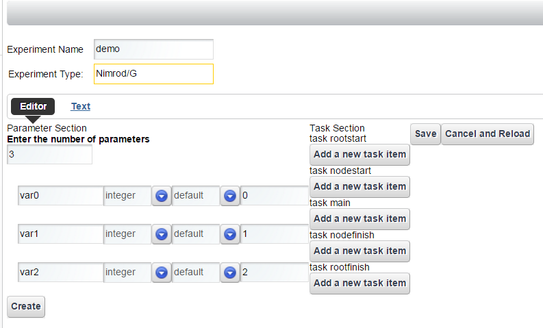
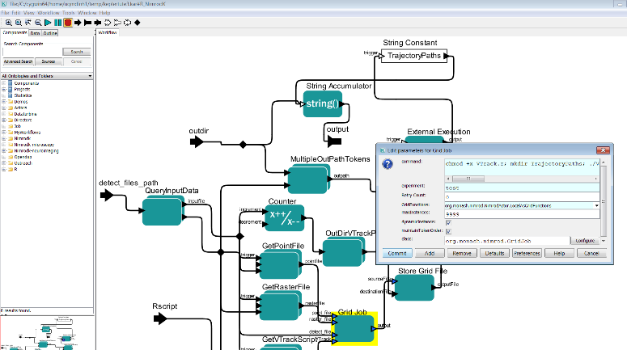
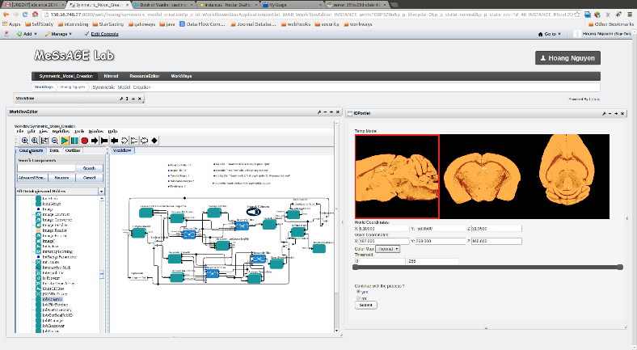

# Nimrod toolkit for high throughput computing in the cloud

## Introduction

The Nimrod tool family facilitates high-throughput science by allowing
researchers to use computational models to explore complex design
spaces. Models can be executed across changing input parameters.
Different members of the tool family support complete and partial
parameter sweeps, numerical search by non-linear optimisation, and even
workflows. Further, Nimrod allows computational researchers to use a
mixture of university-level infrastructure and commercial clouds.

There are several ‘flavours’ of Nimrod. Which Nimrod you choose to use,
either singly, or in combination, will depend on the kind of experiment
you want to run.

### Nimrod/G

Nimrod/G can directly execute large-scale distributed parameter sweep
and Monte-Carlo computational experiments. It provides a simple means to
dramatically scale-up your computational experiments. Each experiment
can run over an aggregated ad-hoc computational grid/pool/cloud; start
from your desktop, local server or cluster; add grid resources (e.g.
clusters and Condor pools); overflow to pay-as-go cloud services and
control your budget with Nimrod/G's economic scheduling capabilities.

### Nimrod/K

Nimrod/K is built on Kepler using Kepler’s runtime engine Ptolemy. It
extends Kepler by adding parameter tools and grid/cloud services and by
providing dynamic parallelism in workflows.

It uses a dataflow execution model that was originally developed for
highly parallel dataflow computers in the 1980’s, and this provides an
extremely rich execution mechanism. It leverages a number of the
techniques developed in the earlier Nimrod tools for distributing tasks
to the Grid.

### Nimrod/O

Provides an optimisation framework for optimising a target output value
of an application. It allows a user to run an arbitrary computational
model as the core of a non-linear optimization process. Nimrod/O allows
a user to specify the domain and type of parameters to the model, and
also a specification of which output variable is to be minimized or
maximized. Accordingly, a user can formulate a question like: what
parameter settings will minimize the model output? Nimrod/O currently
employs a number of built-in optimization algorithms:

-   BFGS

-   Simplex

-   Divide and Conquer

-   Simulated Annealing.

Jobs can be executed on a variety of platforms, which when combined with
Nimrod/G includes distributed clusters and Computational Grid resources.

## Target Audience

The following research activities can benefit from using Nimrod.

1.  You need to run your computational model many times and average the
    results because the model is stochastic. These types of Monte Carlo
    simulations are greatly facilitated by Nimrod/G. It will generate
    multiple jobs, furnishing them with different random number seeds
    and execute them concurrently on the grid.

1.  You wish to explore the effect of varying the inputs to your model.
    Inputs may be in the form of command line parameters or of values in
    some input file; in Nimrod these are both called parameters. Either
    way Nimrod/G will let you specify values for each parameter, will
    generate the jobs for all possible combinations of these values and
    execute the jobs on the Grid.

1.  You wish to explore the effect of input parameters but for certain
    combinations are not allowed. There are several possible ways to
    do this. If the disallowed combinations give jobs that quickly fail
    then you may schedule all possible combinations and let those bad
    jobs fail. However, if those jobs will use substantial resources
    then it would be better to filter them out first. This can be done
    in Nimrod/G by processing the run file. Alternatively Nimrod/O may
    be used in sweep mode as it provides the functionality to add
    formulas for constraints on the parameters.

1.  You are running several different experiments. They may produce some
    jobs with the same inputs and you don't want to waste resources
    duplicating these jobs. Nimrod/O can be invoked with a persistent
    cache shared by the experiments, so avoiding duplications.

1.  You wish to find the combination of input parameters that produce an
    optimal output. Nimrod/O allows you to specify the inputs that vary,
    any constraints on those inputs, and the output to be maximized
    or minimized. It offers a selection of search methods for finding
    the optimum. Multiple searches, perhaps using different optimization
    methods, may be run in parallel.

1.  You want to find the inputs that generate the best output. Nimrod/O
    allows optimization where human input may be used to assess the
    quality of an output. This is especially useful for complex outputs
    such as images or animations.

1.  There are several aspects of your model output that you wish
    to optimize. Nimrod/O is currently being modified to facilitate such
    multi-objective optimization.

1.  You wish to perform multiple optimizations on the output of your
    model, one optimization for each combination of some
    parameter settings. This can be done using Nimrod/G to sweep over
    the setting and having it call Nimrod/O to do each optimization.

1.  You wish to run your model in reverse. In other words you want to
    find the input values that will produce a given output. Nimrod/O is
    commonly used for this task. You need to have a way of measuring the
    discrepancy between your output and the desired one. Then run an
    optimization to minimize this discrepancy.

1. You have developed your own optimization method. You wish to use the
    method, taking advantage of the distributed execution of jobs and
    the caching supplied in Nimrod/O.

1. Different parts of your model need to run on different machines
    because of data files perhaps or licence requirements. Nimrod/G can
    schedule such workflow experiments and perform the appropriate
    communication between the parts. Where possible a downstream
    component may start processing its input file before an upstream
    component has completed that file.

1. Some of your model executions require prior execution of
    other models. Nimrod/G can handle such dependencies.

## How to install

Nimrod allows computational researchers to use a mixture of
university-level infrastructure and commercial clouds.

Users can trial their Nimrod experiments using the Nimrod Portal
resource pool. Users are encouraged to bring their own compute resources
(e.g. cluster, cloud allocation) to use with Nimrod. Please contact Minh
Dinh and Hoang Anh Nguyen regarding adding new remote compute resources
to their experiments.

Users can still opt to install Nimrod Toolkit on their local system,
provided that system meets the software and operating system
requirements outlined in the Resource Requirements section. If the user
chooses to do that, here are step by step procedures for installing
individual Nimrod Toolkit.

### Installing Nimrod/G

Users must executed the following steps to install Nimrod/G:

1.  Download Nimrod/G source distribution

1.  Setup Nimrod/G environment

1.  Create experiments directory

1.  Install Nimrod/G

1.  Setup Nimrod/G database

#### Download Nimrod/G Distribution

Download from following link:

-   https://messagelab.monash.edu.au/Downloads

Download the Nimrod/G source archive to your home directory, which
should create a file:

-   **$HOME/nimrodg-\[version\].tar.gz**

#### Setup Nimrod/G Environment

We recommend editing your shell **rc** scripts
(**.profile** or **.bashrc** or **.cshrc**, etc), or adding
an **/etc/profile.d/nimrod.sh** script for system-wide installs.
For **sh** based shells you will need something like (paths should be
altered as appropriate for your install/system):

> export NIMROD\_INSTALL=$HOME/bin/nimrodg export
> NIMROD\_DATABASE=pgsql-pool
>
> export PSQL\_LOCATION=/usr/bin \# in this case /usr/bin/psql should be
> a valid path
>
> export PYTHONPATH=${NIMROD\_INSTALL}/share/nimrod:${PYTHONPATH}\
> export PATH=${NIMROD\_INSTALL}/bin:${PATH}

#### Create Experiments Directory

Nimrod/G keeps all the experiments it runs in a subdirectory of user's
home directory $HOME/.nimrod/experiments. Create that directory by
executing the following command:

> $ mkdir -p $HOME/.nimrod/experiments

#### Install Nimrod/G

1.  Decompress Nimrod/G source archive. Let’s assume we downloaded a
    source archive for Nimrod/G version 4.0.2:

> $ cd $HOME
>
> $ tar -zxvf nimrodg-4.0.2.tar.gz

1.  Configure and install Nimrod/G

> $ cd nimrodg-4.0.2
>
> $ ./configure --prefix=$NIMROD\_INSTALL
>
> $ make; make install

#### Setup Nimrod/G Database

Nimrod/G runs on top of PostgreSQL relational database. Before anything
can be done, user must create a database which will be used by Nimrod/G.
Each Nimrod/G user requires their own PostgreSQL database.

1.  As a PostgreSQL admin user create a PostgreSQL user. Must ensure
    > that the user can create databases (prompted during the process):

> $ createuser &lt;username&gt;

1.  As the user, create a database

> $ createdb

1.  As the user, populate that database with Nimrod/G database schema

> $ nimrod dbcreate

#### Platform and Version Specific Notes

-   Python 2.6

> To configure the Nimrod build files against Python2.6 (confirmed on
> Ubuntu 10.04) it seems to be necessary to set LDFLAGS=-lm.

-   Ubuntu 10.04

> To configure the Nimrod build files against the included Python2.6 on
> Ubuntu 10.04 it seems to be necessary to set LDFLAGS=-lm.

-   RHEL6

> Using the OS default Python (2.6) to install Nimrod may result in the
> make install step failing to install 3rd party modules that are
> packaged with Nimrod, with an error message like:
>
> You are attempting to install a package to a directory that is not on
> PYTHONPATH and which Python does not read ".pth" files from.
>
> This can be remedied by ensuring $NIMROD\_INSTALL/share/nimrod is in
> your $PYTHONPATH environment variable.

### Installing Nimrod/K

Users must executed the following steps to install Nimrod/K:

1.  Download Nimrod/K distribution

1.  Install Nimrod/K

#### Download Nimrod/K Distribution

This can be done by following Nimrod/K link at:

-   https://messagelab.monash.edu.au/Downloads

Download the Nimrod/K distribution to your home directory which should
create a file:

-   $HOME/nimrodk-\[version\].jar

#### Steps to install Nimrod/K

For the purposes of this installation guide, we will assume that the
version we are working on is 2.0.0. Nimrod/K major version number will
always follow Kepler's major version number so version 2.0.0 means that
this version of Nimrod/K will work with latest version of Kepler with
major version number

Nimrod/K jar file has following install options:

> options:
>
> --help|-h -- print this message
>
> --acceptlicense|-a -- accept Nimrod/K license without prompting. If
> omitted user will be
>
> given a choice (declining will stop the installation).
>
> --prefix=&lt;path&gt; -- set a location of where all Nimrod/K modules
> are installed (eg. –
>
> prefix=/usr/local/kepler/2.4/lib). If omitted it will prompt for
>
> the prefix
>
> --keplerversion=&lt;major version number&gt; -- set a kepler version
> (eg. --keplerversion=2.4).
>
> If ommitted installer will look for it in the following files and
>
> in the order they are listed here:
>
> a\) &lt;prefix&gt;/build-area/install-id.txt
>
> b\) $KEPLER/build-area/install-id.txt
>
> --version|-v -- prints the Nimrod/K version

Using the above options install Nimrod/K:

> java -jar nimrodk-2.0.0.jar \[options\]

### Installing Nimrod/O

A comprehensive manual for Nimrod/O can be downloaded from:

<http://messagelab.monash.edu.au/NimrodO/Documentation?action=download&upname=NimrodOUsersGuide3.1.pdf>.

It contains information on how to install Nimrod/O.

## How to launch

### Running Nimrod/G

In order to run Nimrod/G experiments from command line user needs to do
the following:

-   Manage Resources

-   Manage Experiments

Once these are done, experiments can be executed on selected resources.

#### Resource Management

##### Adding Resources

Nimrod resources need to be first added to the database before they can
be assigned to and used by experiments. Syntax for adding resources is
as follows:

> $ nimrod resource add &lt;resource\_type&gt;
> &lt;resource\_details&gt;

Resource types supported by Nimrod/G include:

-   **Fork**

> $ nimrod resource add fork

-   **PBS** - With PBS we need to know the name of a PBS queue and the
    > hostname of the PBS server. Lets say queue name is **workq** and
    > the hostname is **localhost**

> $ nimrod resource add pbs workq@localhost

-   **SGE** - Same as PBS

-   **EC2**

##### Removing Resources

Syntax for removing resources is as follows:

> $ nimrod resource remove &lt;resource\_type&gt;
> &lt;resource\_details&gt;

#### Experiment Management

This section will describe how to create, monitor and manage Nimrod/G
experiments.

##### Creating a Plan File

Nimrod/G uses a simple declarative language to describe the experiments.
This description is usually written as a simple script file we call
a **plan file**.

There are two sections in this plan file. The first one describes the
parameters that your experiment has while the second one describes the
task/s that Nimrod/G needs to execute to complete a single instance (or
a job) from your experiment. The example below shows a fictional plan
file for an experiment investigating wing performance.

> parameter aircraft\_model files select anyof "A3??.dat" "737-\*.dat";
>
> parameter AoA label "Angle of attack" float range from -45 to 45 step
> 2.5;
>
> parameter winglets text select anyof "none" "fence" "blended" "raked";
>
> parameter airspeed integer range from 50 to 600 step 50;
>
> parameter turbulence label "Normalized Reynolds" float random from 1
> to 2;
>
> task main
>
> copy ${aircraft\_model} node:.
>
> copy wing\_test.zip node:.
>
> node:execute unzip wing\_test.zip
>
> node:execute ./run\_wing\_test.sh ${aircraft\_model} ${winglets}
> ${AoA} \\
>
> ${airspeed} ${turbulence} &gt;&gt; output.${jobname}
>
> node:execute zip results.${jobname} \*
>
> copy node:results.${jobname}.zip .
>
> endtask

This is a somewhat contrived example demonstrating various parameter
types but it illustrates the basic functionality of defining parameters
for the main task and handling input, execution and output for each of
the parameter combinations. The two subsections below explain the
'parameter' and 'task' definitions in the plan file.

##### Parameters

Parameters define lists of values, constant single values or dynamic
values (of various types). A unique combination of parameter values is
assigned to each job and each parameter value is bound to a named
identifier in the job environment. Nimrod/G experiments usually create a
cross-product of all parameters to define the jobs which make up the
experiment, we call this a full parameter sweep. The syntax for
parameter lines in the plan file is:

> parameter &lt;name&gt; &lt;type&gt; \[&lt;domain&gt;\];

-   **name** - This is the parameter name which must be unique.

-   **type** - This part of the parameter tells Nimrod/G what type of
    parameter this is. There are five types and they are

    -   **float** - floating point number

    -   **integer** - integer (whole) number

    -   **text** - textual values as shown in the example above

    -   **files** - this type allow you to apply glob style file name
        matching to create a list of files names within the experiment
        directory which match the given pattern(s), you could use this
        to parameterize the input files for your computation (like the
        example above). The files type **must be** used with the "select
        anyof" domain.

    -   **fromfile** - this type must refer to a text file that contains
        a list of values, i.e., the file contains the entire range.

-   **domain** - A parameter domain is optional in some cases but
    usually required. The following domains are available:

    -   **default**- this domain type has only a single value. The
        syntax for this domain is:

> default &lt;value

-   **range** - this domain type has a number of values (points) that
    are within a specified range. The syntax for the range domain is:

> range from &lt;value&gt; to &lt;value&gt; points &lt;value&gt;
>
> range from &lt;value&gt; to &lt;value&gt; step &lt;value&gt;

-   **random** - this domain type has a number of random points
    generated between specified lower and upper bounds. The syntax for
    this domain is

> random from &lt;value&gt; to &lt;value&gt; \[points &lt;value&gt;\]

-   **select anyof** - this domain type is usually used for text and
    files but is also useful for listing fixed numerical values. The
    syntax for this domain is:

> select anyof &lt;value\_list&gt; \[default &lt;value\_list&gt;\]

-   **select oneof** - Similar to 'select anyof' except that only one
    value will be selected for use from this list. If the default value
    is not specified the first value in the value\_list is used. The
    syntax for this domain is:

> select oneof &lt;value\_list&gt; \[default &lt;value&gt;\]

-   **(some input file)** - when using the fromfile type, the domain is
    an input file that lists the values for the parameter. For example:

> parameter x fromfile inputfile.txt
>
> means that **inputfile.txt** contains a list of single values (one per
> line) for parameter **x**.

##### Tasks

This part of the plan file describes the process of executing a single
instance of your experiment. There are a number of
operations/commands/directives that can be performed in a task:

-   Copy files to and from compute resources

-   Executing an experiment executable

-   Substituting place-holders in the input files with the real values

-   What to do in case the job fails.

Task operations are typically location
dependent. **copy** and **execute** directives must specify where the
operation should be performed or where the file locations are while
copying. This is done by using **node:** or **root:** modifiers.

-   **node:** indicates remote location for the operation. In case
    of **copy** operation it indicates that the file resides on remote
    machine, while in case of **execute** command it indicates that the
    executable should be run on the remote server.

-   **root:** on the other hand indicates that files are on the same
    machine where Nimrod/G is running, and that **execute** command that
    executables are to be run on that same machine, and not on the
    remote server. Please note that **root:execute** can only be
    executed in **rootstart** and **rootfinish**tasks.

**NOTE**: In a typical parameter sweep all program invocations will
occur on computational nodes and hence the main task will only use
**node:execute**.

Following is a more thorough description of the task operations:

-   **copy** - this operation is used to copy both input and
    > output files. Syntax for this operations is as follows:

> copy &lt;source&gt; &lt;destination&gt;
>
> For example if you are copying input file to a remote location:
>
> copy root:input.txt node:input.txt
>
> And if you are copying output file back to the server where Nimrod/G
> is running:
>
> copy node:result.txt root:result.txt

-   **execute** - this operation is used to execute some executable. The
    syntax for this operatio is:

> node:execute &lt;user\_command&gt;
>
> **user\_command** is passed to shell (**/bin/sh**), so it can contain
> shell constructs (redirection like &gt;, &gt;&gt; etc).
>
> For example if we wanted to execute **hostname** command and redirect
> its output into a file called **hostname.txt** this is what
> the **execute**operation would look like:
>
> node:execute /bin/hostname &gt; hostname.txt

-   **onerror - this operation indicates how Nimrod/G should behave in
    case some part of the job fails. It has a scope which is from the
    point it appears until another onerror statement is found. The
    syntax for this operation is:**

> onerror &lt;option&gt;
>
> Valid options are:

-   **fail** - fail the job. This is the default behaviour and will be
    > used even if **onerror** is never specified in the plan file

-   **ignore** - ignore the error and proceed with the task, ie. move
    > onto the next line in the plan file and continue executing it.

<!-- -->

-   **substitute** - Nimrod/G allows can use skeleton input file for
    > their experiments. This skeleton input file may contain
    > placeholders in it that are to be substituted by the actual
    > parameter values before the execution begins.

> This operation is used to replace the parameter placeholders in input
> file with a job parameter value. The syntax of this operation is:
>
> substitute &lt;source&gt; &lt;destination&gt;
>
> Both source and destination require neither 'node:' nor 'root:' in
> front of them, i.e. they are just plain filenames. For example, this
> could be a main task of a plan file:
>
> task main
>
> copy input.skeleton node:.
>
> substitute input.skeleton input.txt
>
> node:execute ./process.sh input.txt &gt; result.txt
>
> copy node:result.txt .
>
> endtask

#### Creating Experiments

Nimrod/G stores experiments in a specific location in user's home
directory:

> $HOME/.nimrod/experiments/

Each experiment will have a dedicated subdirectory in that location that
matches experiment name. For example:

-   Experiment named **demo** will be
    > in **$HOME/.nimrod/experiments/demo/**

    -   Plan file called **demo.pln** will be in that directory

    -   All files related to that experiment will also be location in
        > that directory

In order to create experiment execute the following steps:

1.  Create a plan file following instructions from the previous section.
    > Lets assume we create a plan file called **demo.pln**

1.  Create an experiment directory:

> $ mkdir -p $HOME/.nimrod/experiments/demo

1.  Place the demo.pln file in that directory

1.  Create a file containing all possible parameter combinations:

> nimrod generate demo.pln

1.  Add the experiment to the Nimrod/G database:

> nimrod create demo

#### Assign Resources to Experiments

In section Resource Management we added compute resources to the
database. In order for them to be used by an experiment they have to be
assigned to that experiment. The syntax for adding resources to
experiments is as follows:

> nimrod addserver &lt;exp\_name&gt; &lt;resource\_details&gt;
> &lt;resource\_type&gt;

Resource type and resource details are exact same details that were used
when resources were added to database. An example of adding a PBS
resource to a demo experiment can be seen below:

> nimrod addserver demo workq@localhost pbs

#### Launching Nimrod/G

With experiments defined and configured Nimrod/G can be launched. The
syntax for this command is as follows:

> nimrod startexp &lt;exp\_name&gt;

For example, to start the experiment called demo run:

> nimrod startexp demo

### Using Nimrod/K

Nimrod/K extends Kepler by adding parameter tools and grid/cloud
services and by providing dynamic parallelism in workflows. As such
Nimrod/K functionality is simply used by adding the Nimrod/K director
and Nimrod/K actors to Kepler workflows.

### Using Nimrod/O

A comprehensive manual for Nimrod/O can be downloaded from:

<http://messagelab.monash.edu.au/NimrodO/Documentation?action=download&upname=NimrodOUsersGuide3.1.pdf>.

It contains information on how to launch Nimrod/O.

## Resource Requirements

Nimrod Toolkit runs on Unix based platforms only, which includes all
flavours of Linux as well as Mac OS X. However, Nimrod Portal component
is browser based which allows users of all platforms (including Windows)
to access Nimrod and execute computational experiments through any
browser.

-   Software Requirements:

    -   Python – version 2.5 or higher

    -   PostgreSQL – version 8.4 or higher

-   Operating System Requirements

    -   Linux

    -   Mac OS X

Nimrod/O can run in standalone mode, in which case Nimrod/G is not
required. However in standalone mode Nimrod/O loses the ability to run
its jobs on distributed clusters and computational grid resources.
For distributing jobs, Nimrod/G 4.0 or higher required

Similar to Nimrod/O, Nimrod/K can run as a standalone application, in
which case Nimrod/G is not required. When running in standalone mode
Nimrod/K can be installed and used on Windows machines.

### Compute Resources

Nimrod allows computational researchers to use a mixture of
university-level infrastructure and commercial clouds. For beginners,
users can trial their Nimrod experiments using the Nimrod\_Portal[^1]
resource pool. Users are encouraged to bring their own compute resources
(e.g. cluster, cloud allocation) to use with Nimrod. Please contact Minh
Dinh and Hoang Anh Nguyen regarding adding new remote compute resources
to their experiments.

## Nimrod Portal

A web service for using Nimrod/G. Nimrod portal provides a web interface
for users to use Nimrod and its resources. Users can create Nimrod/G
experiments without installing Nimrod toolkit on their local system.
This allows users develop, execute, maintain and share Nimrod parameter
sweep experiments.

### Installation

Nimrod portal consists of two components: a RESTful Web service and a
Web portal. The RESTful service is to expose Nimrod functionality to the
Web and the Web portal provides user-friendly interface to the users.

The installation process requires two steps: installation of the Web
service and installation of the Web portal. This two-step process takes
place in two separate VMs. Nimrod needs to be installed in the Web
service VM.

#### Install Nimrod Web service

The Web service is currently available at:
<https://bitbucket.org/jhtngu/nimrod.webservice>.

This is not a public repository. Please email <hoangnguyen177@gmail.com>
to gain access.

-   Once clone the repository, modify the buildout.cfg as followed

> \[sources\]
>
> Nimrodrestapi = git
> https://yournamehere@bitbucket.org/jhtngu/nimrod.restfulweb.git
> branch=addresources
>
> nimrodrpcdaemon = git https:// yournamehere
> @bitbucket.org/jhtngu/nimrod.rpcdaemon.git branch=addresources

-   Execute “python bootstrap.py” to setup the environment. This
    requires setuptools installed.

-   Execute “./bin/buildout” to clone and install necessary packages,
    including Nimrod Web service.

-   Install any missing dependencies as suggested by the build process.

-   Modify configuration files in the “etc” folder accordingly.

#### Install the Web portal

-   Install Liferay 6.1
    (<http://sourceforge.net/projects/lportal/files/Liferay%20Portal/6.1.1%20GA2/>).
    The recommended location is: /var/www.

-   Follow Liferay instructions to install with Postgres DB
    (<https://www.liferay.com/community/wiki/-/wiki/Main/Quick+Installation+Instructions>)

-   Go to Liferay market and install Private Plugin Installer
    (<https://www.liferay.com/marketplace/-/mp/application/15474932>)

-   Install Vaadin into Liferay
    (<https://vaadin.com/wiki/-/wiki/Main/Integrating+Vaadin+7+with+Liferay>)

-   Install Nimrod portlets, which are available at:
    <https://bitbucket.org/hoangnguyen177/nimrodportal2>. Or contact
    <hoangnguyen177@gmail.com> for compiled version.

-   Install Nimrod portlets

#### Configure the portal and the Web service VM

From NeCTAR dashboard, make sure the port of the Web service (8081 by
default) is accessible by the Web portal and Nimrod ports (40000 -
41000) are accessible by all.

### Launch

Launch the Web portal first:

> cd /var/www/liferay-portal-xxxx/tomcat-xxx/bin; sudo ./startup.sh

Then launch the Web service:

> cd \~/nimrod.webservice/bin; ./supervisord;

### Plan file web editor

Instead of using a text editor, the Nimrod Portal provides a simple
friendly GUI for users to develop plan file for Nimrod/G experiments.

## How to access it

Interested users can register for an account using their AAF credential
at the following page (will need to be updated later):
<http://vm-203-101-224-118.qld.nectar.org.au/>

The portal provides a friendly web interface for users to define,
execute and monitor their experiments. For users who have existing
Nimrod experiments, they can upload the plan files. User can also create
new experiments using a simple GUI. Input and output files can be
uploaded and downloaded using the web interface. For technical supports
and learning to use Nimrod, please contact Minh Dinh and/or Hoang Anh
Nguyen.

## Configuration guide

### Configuring Nimrod/G

Nimrod/G installation comes with two configuration files, both located
in **$NIMROD\_INSTALL** directory:

-   **nimrod.cfg** - Configuration values contained within can be
    overridden by a user level configuration file of the same name,
    which may be located in $HOME/.nimrod/ directory, or by an
    immutable configuration file described below.

-   **nimrod.immutable.cfg** - Configuration values contained within
    will override any other configuration, either user or system level.

Most of the configuration values can be left as is but some may be
changed to match the system requirements.

Each configuration file may contain following sections:

-   **email** - used to configure email settings. This is used to report
    experiment completion.

-   **nimserver** - configures Nimrod/G component called Nimrod Server.
    Nimrod/G uses executables called **Agents** to execute jobs on
    remote resources. **Agents** use Nimrod Server to communicate with
    database as well as to copy files to and from remote locations.

> Most of the configuration can be left as is. It is important however
> to ensure that **default\_port\_range** configuration value has a
> range of ports that can be reached by outside networks. When it
> starts, **Nimrod Server** will select a first available port from that
> range and will use that to listen for incoming connectinos
> from **Agents**. If the port it selects is unreachable, no jobs will
> run.
>
> For example (port will be selected anywhere between 30000 and 31000
> inclusive):
>
> nimserver: {
>
> default\_port\_range: '30000,31000'
>
> key\_path: $user\_dir + '.nimserver'
>
> remote\_suffix: $remote\_suffix
>
> remote\_key\_fname: '.nimserver' + $nimserver.remote\_suffix + '.pub'
>
> port\_path: $user\_dir + '.nimport' + $nimserver.remote\_suffix
>
> remote\_port\_fname: '.nimport' + $nimserver.remote\_suffix
>
> }

-   **actuator** - configures resource actuators, components that
    control how resources are used. It can be used to change how often
    actuators poll database to see if there are any work they need
    to do. Configuration can apply to actuators for all resource types,
    but can also only apply to a specific resource type.

-   **azure** - configure **azure** resource settings. Can be left
    as is.

-   **ec2** - configures **ec2** resource settings. Can be left as is

-   **generate** - configures **generate** subcommand. This subcommand
    is used to parse the plan file and create another files that
    contains a cross-product of all parameters. Some of the settings
    include limits on how many jobs single experiment can have, or how
    long a parameter name can be.

> For example:
>
> generate: {
>
> max\_jobs: 100000
>
> param\_len\_limit: 56
>
> }

### Configuring Nimrod/K

There is no Nimrod/K specific configuration.

### Configuring Nimrod/O

A comprehensive manual for Nimrod/O can be downloaded from:

<http://messagelab.monash.edu.au/NimrodO/Documentation?action=download&upname=NimrodOUsersGuide3.1.pdf>.

It contains information on how to configure Nimrod/O.

## Technical blueprint

To date, Nimrod tools are deployed through several Nimrod portals
stationed at Monash University, Griffith University and The University
of Queensland. These portals provide the machinery to automate the tasks
of formulating complex experiments and workflows, and execute them
across a variety of computing resources including NecTAR VMs. In
particular, we ran several projects to test the migration of scientific
software to HPC platforms, including the NeCTAR research cloud, to
provide enhanced utility for the following research projects.

### Terrestrial Ecosystem Research Network (TERN)

Supporting the creation and execution of sensory data analysis using
Nimrod portal to access available computing resources in the NecTAR
cloud.

### CVL Symmetric Model Creation

Coupling Nimrod to perform expensive computations efficiently and
integrating visualization library to enable examination of intermediate
models.

### MARXAN

Coupling the MARXAN web portal with Nimrod to provide access to HPC and
cloud resources.

## Troubleshooting

There are multiple points of failure that are possible when running
Nimrod/G experiments:

-   Problem with executables (applications) that Nimrod/G is trying to
    execute

> These will be reported back to database. In scenario like this is
> highly possible that all jobs will fail because of it. However the
> problem can be environmental in which case it will only fail on a
> particular resource or even a particular machine on that resource.

-   Problem with remote machines where Nimrod Agents are running

> These kind of problems occur when a particular machine on a
> computational resource is not working correctly. There are many
> reasons this may occur, which includes missing libraries, faulty
> hardware etc.
>
> If the agents manage to start then these are easy to identify. Nimrod
> Agents will fail the jobs and record which host the job failed on.
> Listing failed jobs, and seeing that all failed on a particular host
> will indicate a problem with that host.

-   Firewall issues preventing Nimrod Agents connecting back to Nimrod
    Server

> If Agents are perpetually stuck in **pending/queued** state, it
> usually indicates that they cannot connect back to Nimrod Server. One
> reason is that there is a faulty host and **Agents** never start, and
> second reason is that firewall on either host is preventing
> those **Agents** connections.

There are number of commands that can be executed to collect information
that may help identify the issue:

1.  Get reported errors

> $ nimrod geterrors &lt;exp\_name&gt;

1.  Check if there are any agents running on resources

> $ nimrod getagents &lt;exp\_name&gt;
>
> Output returns a list of resources where each line has the resource
> name and agent information in following order:

-   Agents that have stopped running (cleanly)

-   Agents that are still running

-   Agents that have been submitted to a remote queue

-   Agents that have been created in database, but not submitted to a
    remote queue

-   Agents that have failed to start. Some agents may fail to start but
    won't be reported here. This will occur if firewall is blocking
    the connections.

1.  Check the progress of experiment and see if there any failed jobs:

> $ nimrod enfapi &lt;exp\_name&gt; jobstatus

1.  If there are failed jobs, get errors for all failed jobs:

> $ nimrod enfapi &lt;exp\_name&gt; getjobinfo all error

## Support

### Administration

Please contact Hoang Anh Nguyen or Minh Dinh for the Nimrod Portal

### Technical Support

All queries regarding the for the Nimrod Portal and WorkWays portal,
please contact Hoang Anh Nguyen or Minh Dinh

### Learning to use Nimrod or integrating Nimrod into your internal service

Please contact Minh Dinh regarding learning to use Kepler and Nimrod.
For consultation on how Kepler and Nimrod can be applicable for specific
research fields, please contact Minh Dinh.

## Contact

Dr Minh Dinh

QCIF - eResearch Analyst

Reserch Fellow - Research Computing Center (RCC)

Email: <m.dinh1@uq.edu.au>

Mr Hoang Anh Nguyen

Email: <hoangnguyen177@gmail.com>

## Glossary of Terms

[^1]: Nimrod\_Portal is a Nectar allocation that consists of up 120
    compute cores. It is designated for deploying Nimrod services and
    conducting Nimrod runs. It is an independent testbed for new users
    to trial Nimrod and its tools
