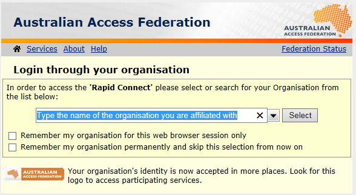
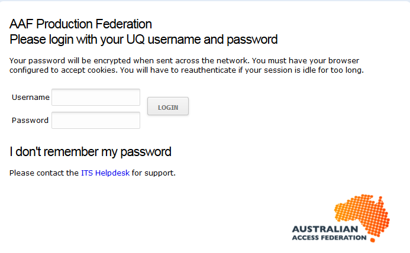
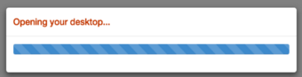
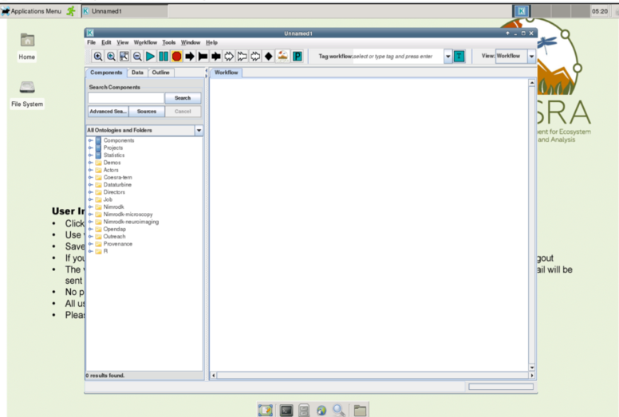
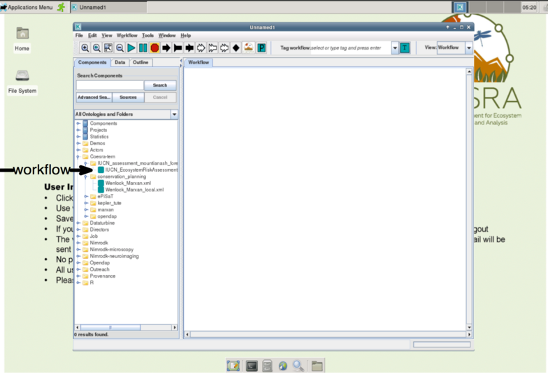
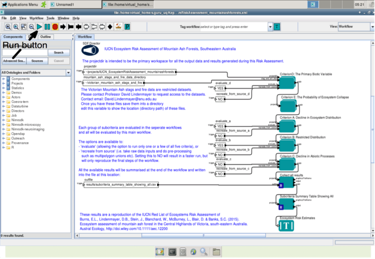
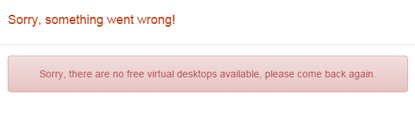

# CoESRA Remote Desktop - User Guide

## Type

The Collaborative Environment for Ecosystem Science Research and Analysis
(CoESRA) is a Platform-as-a-Service (PaaS) service developed by the
[Terrestrial Ecosystem Research Network](http://tern.org.au/)
network to serve the ecosystem science community.

## Description

The CoESRA is a workflow-based web platform that allows researchers
(primarily ecosystem scientists) to perform complex analyses without
having to set up experiments from scratch and worry about having enough
resources to run the analyses. CoESRA provides users with a cloud-based,
'remote desktop' platform with pre-loaded analytical and synthesis tools.
It was built to enable ecosystem scientists to orchestrate, compose and
execute experiments as repeatable workflows. Kepler is used within the
desktop as a composition, orchestration and execution engine. Kepler is
an open source workflow management tool for the design and execution of
scientific workflows.

The CoESRA service provides an opportunity not only to reuse data but
also to reuse tools for data manipulation, scripts for data visualisation,
and algorithms for analysis processes. Once a specific analysis has been
conducted, the entire workflow can be stored and shared with other scientists.
Finally, the workflow can published to
[Research Data Australia](https://researchdata.ands.org.au/)(RDA).

Through use of the CoeSRA desktop, the community will gain access
to data streams, tools and often hidden
'pipeline' processes to leverage further knowledge about ecosystem
science experiments.

The Linux-based virtual desktop platform is best accessed via the Chrome
Web browser. It enables users to access Web-based data sources, e.g. data
stored on DropBox, CloudStor or Google Drive, or other data sources related
to ecosystem science. The provenance information for this data can be stored.
All registered users get a public and private home folder which can be used
to store data and workflows.

Workflows can be shared in a common public folder "public_share_workflow",
which is accessible by all registered users. Workflows can also be stored
on [MyExperiment](http://www.myexperiment.org/home) and the
[Australian National Data Service](http://ands.org.au/)'s
[Research Data Australia](https://researchdata.ands.org.au/) by creating
a service record from the Kepler menu.

To have a workflow integrated into the CoESRA platform, please email
[tern.coesra@gmail.com](mailto:tern.coesra@gmail.com).

On launch, the platform includes the following applications: R, RStudio,
Python and Kepler. It also includes
[Nimrod software](https://support.nectar.org.au/support/solutions/articles/6000095294-qcif-nimrod).
Other software can be added to the live desktop by users.

The CoESRA desktop is a time-limited service. It is provisioned initially
for two days. A user will get an email notification six hours before the
virtual desktop is remotely terminated. If users want to extend their access,
they can request an extension from the system administrator, or by responding
to the desktop termination reminder email.

## Target audience

The service has been developed to meet the needs of the ecosystem science
community, including researchers in the TERN network.

## Resource requirements

CuNo installation is required as the desktop is virtually hosted.

Currently, CoESRA is accessible using the Google Chrome browser only. Other
browsers will eventually be supported.

Firefox is the only browser available as part of the virtual desktop platform
once the platform has launched.

## How to access

Users can access CoESRA via their
[Australian Access Federation](http://aaf.edu.au/) (AAF) credentials.

Steps:

1) Go to [CoESRA](https://www.coesra.org.au/).

2) Click on **Register**.

If this is a user's first visit, s/he will be taken to the
[AAF](http://aaf.edu.au/)'s **Log in through your organisation** service.

The user should select the institution name from the drop-down list and
then check one of two options for subsequent log ins:

- Remember my organisation for this web browser session only

- Remember my organisation permanently and skip this selection from now on

To simplify future access, users should select the 'Remember my organisation
permanently' option.

The user should then follow the steps to log in via their own institution.
Once the organisation has been selected, the user will be taken to the log
in site for that institution, e.g., a user coming in via
[The University of Queensland](http://www.uq.edu.au/) will see this screen:

3) Once a user has successfully entered credentials, the screen will
refresh with

4) The desktop will then deploy.

A virtual desktop will load, with the Kepler environment open by default.

On the left-hand side menu in Kepler, click on "Coesra-tern" and subsequent
folders to see the workflow icons.

Double-click on the workflow icon of your choice and the workflow will
open in a new Kepler window.

Click on the Run button to run a workflow. Some workflows may require
additional datasets for successful execution.

## Non-AAF-accredited users

Access is possible even if an individual does not have AAF credentials.
Please contact [tern.coesra@gmail.com](mailto:tern.coesra@gmail.com) for
guest account access.

## Issues

The system has the capacity to launch only a specific number of desktops at
any one time. If there is no more capacity in the system, you will get the
following error message:

The only solution here is to try again later.

## Configuration guide

The desktop comes 'as is'. Researchers are able to customise it, but are
strongly discouraged from doing so. According to the
[FAQ](https://www.coesra.org.au/#/faq) on the site: "We strongly recommend
users not to make any changes to the virtual desktop setting because it may
affect the working of the desktop. Any changes made by users will not be
supported."

## Technical blueprint

These are two real-life case studies:

1. animal conservation and management plan

1. ecosystem assessment of Mountain Ash forest.

The first case study links conservation planning software
[Marxan](http://marxan.net) and animal tracking information to increase the
analytical power of these ecological tools and create a repeatable and
reusable workflow for subsequent studies of habitat conservation.

The second case study brings together data and analysis required to apply
[IUCN Red List of Ecosystems](http://www.iucnredlistofecosystems.org/)
criteria to the Mountain Ash forest ecosystem and to make a repeatable
(e.g., able to be re-run in the future with updated time windows and
updated ecological parameters) workflow for the ecosystem assessment
of Mountain Ash forests in the central highlands of Victoria. The workflow
will also enable researchers to re-run the entire assessment with
additional data for certain criteria.

For more information, please email
[tern.coesra@gmail.com](mailto:tern.coesra@gmail.com).

## Frequently Asked Questions

[CoESRA FAQ](https://www.coesra.org.au/#/faq)

## Help

For help and support, please email
[tern.coesra@gmail.com](mailto:tern.coesra@gmail.com).

## Contact

Please email [tern.coesra@gmail.com](mailto:tern.coesra@gmail.com).

