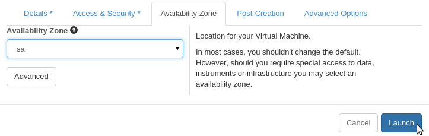

 

## SA node service for users in South Australia

- [Introduction](#intro)
- [Cloud allocation](#alloc)
- [Contact eRSA to obtain the image ID](#setup)
- [Creating a security group](#security)
- [Launching an instance](#instance)
- [Loading the pre-installed software packages](#modules)
- [Sharing files with the virtual machine](#transferfiles)
- [The CentOS operating system](#os)
- [Glossary of Terms](#glossary) 

----

## Introduction 

Description 

Since cloud Virtual Machine (VM) images are restricted in size, it is not possible to have a generic image containing all the different application software that is available on high-performance computing (HPC) systems, such as eResearchSA's [Tizard supercomputer][tizard]. Users have therefore needed to find VM images that contain the software they need, or install it themselves. 

[eResearchSA][ersa] has deployed a distributed software repository that enables cloud virtual machines to easily access all the software applications that are available on the Tizard supercomputer. Users can run any of this software on the cloud virtual machine, just as they can on Tizard.

This service is designed for:

- Researchers who want to use cloud virtual machines to run compute-intensive software applications
- Situations where a single virtual machine image containing all the required software is not available, and the researcher does not want to install the software themselves.
- This service is currently only available for **South Australian users** as it uses the eResearch SA software repository.

## The Software Repository

eRSA has set up a server that provides access to a repository of all the open-source software that is installed on eRSA's HPC systems.  eRSA have also created a Nectar cloud virtual machine image that contains a client that can access the software in the repository. 

When a user runs a software application on the cloud virtual machine, the software is automatically downloaded from the repository and stored locally on the VM. The next time the same software is used, the local copy of the software is accessed so it will start up faster, without having to wait for the download.

For the user, this all happens transparently, it appears as though all the application software is installed on the cloud virtual machine.

[Glossary of Terms](#glossary)   
[Top of page](#top)

----

## Register for an eRSA account

To access the eRSA cloud software repository, you will need to be [registered with eResearchSA].  Email the [eRSA Helpdesk][ServiceDesk] with any queries.

----

## Getting a Project Allocation

Researchers will by default have a trial allocation on NeCTAR (project name pt-XXXXX; 2 cores for 3 months).

You will need to request a project allocation for further resources if:

-  you require more computing power or longer term usage
-  you wish to share cloud computing resources with your research group

Log in to the [NeCTAR dashboard][dashboardalloc] and click on **New Request** under **Allocations** in the left hand side menu. Email the [eRSA Helpdesk](mailto:servicedesk@ersa.edu.au) if you have questions about any of the information in the form. New requests can take a couple of weeks to process, and allocations are merit-based.

[Managing an Allocation page][allocation]  
[Glossary of Terms](#glossary)  
[Top of page](#top)

----

## Contact eRSA to help set-up your instance

Accessing the Cloud software repository is as simple as launching an instance using a specific image designed by eRSA staff, and knowing a few [basic commands](#modules).  

Email the [eRSA Helpdesk](mailto:servicedesk@ersa.edu.au) to inform them you want to set up a VM with access to the software repository, and a support member will give you the name of the current image that you will use.  You can use this information to launch an instance, following the instructions below, or you can request that eRSA set up the VM for you.

## Add your eRSA support contact to your project users group

After you have received a project allocation, you can add collaborators as users to the project by selecting the [Users][users] tab in the project menu on the dashboard and entering the institutional ([AAF][aaf]) email address of your co-workers.

It is recommended that you add the eRSA email address of your eRSA support contact to the users of your project. If you need any assistance in setting up or managing your VM, eRSA staff will need to be a user on the project in order to provide some types of assistance.

[Glossary of Terms](#glossary)  
[Top of page](#top)

----

## Creating a security group

-  If you have not already done so, you will need to create a security group with port 22 open for SSH access. 

-  On the NeCTAR [dashboard][dashboardsec], ensure you are in the correct project.

  

-  Select "Access & Security" under the left hand side pane under "Compute".
-   Select the "Create Security Group" button near the top right corner
-  Give your security group a name and description and click the "Create Security Group" button
-  Click "Manage Rules" in the "Actions" drop-down menu
-   Click on the "Add Rule" button near the top right corner 

-  A small window should pop up. Make sure the "Rule" is set to "Custom TCP Rule" 
  and "Open Port" is set to "Port". Under the Port textbox enter "**22**". Set "Remote" 
  to "CIDR" and under the "CIDR" textbox enter one of the following IP ranges as appropriate.
    - 129.127.0.0/16 - University of Adelaide
    - 129.96.0.0/16 - Flinders
    - 130.220.0.0/16 - UniSA  
-  E.g. for a user from the University of Adelaide:

  

**Security and Access Tip:** Using the IP ranges above will limit VM access to computers connected to your university network. If you would like to access the computers from home or elsewhere, you will have to do this through a VPN connection with your university computer. Alternatively, you can set the CIDR to '0.0.0.0/0' which will allow any IP address to connect to the VM. This will reduce the security of your VM, but you will be able to get SSH access with any computer at any location.

[Security Groups page][security]  
[Glossary of Terms](#glossary)   
[Top of page](#top)

----

## Creating an instance with access to the software repository

See this [training module][train] or this [guide][launch] for detailed instructions on launching an instance if it is your first time and/or you haven't yet set up SSH keypairs.

-  In your project allocation on the NeCTAR [dashboard][instance], navigate to the 'Instances' tab in the 'Compute' menu.

-   Select the "Launch Instance" button near the top right corner

-  Fill in a name for the VM, choose an appropriate size (Flavor), then select the image name provided by eRSA.

  

-  Click the 'Access and Security' tab. Select your SSH keypair and select the security group which allows access through port 22 for SSH (set up in the previous step).

  

-  Click the 'Availability Zone' tab and select '**sa**', Then click '**Launch**'

  

-  Once the Instance is running, use the IP Address to connect to the VM via SSH in the usual way, as outlined in the [Accessing Instances][access] support page and the training module [Launching and Connecting][connect].

[Launching an Instance][launch]  
[Glossary of Terms](#glossary)   
[Top of page](#top)

----

## Loading the pre-installed software packages  

There are a few simple commands to find software packages in the repository and load the environment for the version of the software that you want. This is done using the [Environment Modules package][modules]. You must first load the module (using the [module load command][modulecommands]) for the software you want before you run the software.

| Command  | Action |
| ------------- | ------------- |
| `module --help` | help page for the 'module' commands |
| `module avail` | list all available packages in the repository |
| `module avail <search term>` | list package names containing the search term |
| `module list` | list the packages that are already loaded on the VM |
| `module show <name>` | show info on the package, and lists the required modules to pre-load |
| `module load <name>` | load the package onto the VM |
| `module unload <name>` | remove the package 'cache' from the VM |

An example of loading the package 'Stacks'. 

**NOTE:** If there is software that you would like to access that is not already in the software repository, email the [eRSA Helpdesk](mailto:servicedesk@ersa.edu.au) and request that it be added. Ensure you mention that you would like to access it through cloud computing on your VM.

[Glossary of Terms](#glossary)   
[Top of page](#top)

----

## Sharing files with the virtual machine  

There is a [training module][copy] and a [support guide][transfer] with comprehensive details on transferring data between your VM and your local computer or remote storage servers. Using programs like FileZilla or WinSCP is an easy method of transferring data from your local computer. 

The following information outlines commands that can be entered on your VM in order to transfer data to and from remote data storage, such as the [storage][storage] offered by eRSA. There is also an [eRSA support page][ersatransfer] with more detail on transferring data from eRSA storage.

### Secure Copy (SCP) between the VM and a data storage server

If you have data stored on a remote server, you can transfer files between it and the VM through the command-line on the VM.

You will need a host address for the data storage server, your username, and your password.

`scp <source> <destination>`

`scp username@sftp.ersa.edu.au:/data/myDirectory/file.txt /mnt/data/`  
`scp /mnt/data/results.zip username@sftp.ersa.edu.au:/data/myDirectory/`

You will usually then be prompted to enter the password for your data storage.

  

### SFTP via the Command Line 

Secure file transfer is also available between the VM and remote data storage. This is useful when you aren't sure of the file structure on the remote server, because it allows you to navigate to a file before you download it.

Enter the 'sftp' command while logged on to your VM, and you will have access to the remote storage server.

`sftp username@sftp.ersa.edu.au   `   - you will be prompted for a password.

You are now accessing the remote data storage server, and you can navigate the files on the server as per usual with commands like `cd` and `ls`.  
The commands `get` and `put` will transfer data between the machines:
  
  

to close the sftp connection, type `exit`.

[Glossary of Terms](#glossary)   
[Top of page](#top)

----

## The CentOS operating system

The VM image that allows access to the software repository is a Linux distribution called CentOS. Most of the documentation available about using your Linux VM in the Nectar cloud assumes that you have an Ubuntu operating system.  There is very little difference for the user between these Linux operating systems, but there is one main difference to be aware of.

CentOS uses the package manager '**yum**' instead of '**apt-get**'. If you need to install packages on your VM that aren't in the software repository, you need to use the 'yum' command wherever there would be an 'apt-get' command in Ubuntu. e.g.

- `yum search <package name>`
- `sudo yum install <package name>`
- `sudo yum update`

[Top of page](#top)

----

## Glossary

**Availability Zone**
> A logical grouping of compute nodes within a region.

**Dashboard**
> The NeCTAR Dashboard is the main web-based interface for managing NeCTAR virtuals.

**ERSA**
> eResearch SA runs the South Australian node of the NeCTAR research cloud.

**Flavor**
> An OpenStack term for an instance sizing specification. Gives the amount 
> of memory, number of VCPUs and ephemeral disk size.

**Image**
> An image (or system image) is a copy of the entire state of a computer system 
> saved as a file. Images are used in two ways in NeCTAR. Firstly as a template for 
> Virtual Machines (VMs). You can launch a VM based on an image. 
> The second use of images is to preserve the state of a VM as configured by you as end user. 
> This type of image is usually referred to as a snapshot.

**Instance**
> An instance is a VM hosted on the NeCTAR OpenStack infrastructure.

**Modules**
> [Environment modules][modules] are used to configure a users environment to allow use of the software packages available on the server. The module commands are used to find information on the available packages, and to load the packages for use.

**Node** (compute node) 
> OpenStack terminology for a physical computer used to run virtual machines. It will typically have multiple CPUs and shared memory, and one or more network interfaces. It may also have on-node disk storage.

**Project**
> The NeCTAR term for a "resource container"; i.e. what you get when you 
> are granted a NeCTAR allocation. A project "owns" virtual machine instances, snapshots 
> and various kinds of storage, and may be shared by multiple users.

**Security Group**
> A set of access rules that may be applied to one or more instances. 
> An access rule allows network access to an instance from other hosts with a 
> specified combination of protocol family (e.g. TCP, UDP, UCMP), port number and address range. [Security Groups page][security]

**SSH**
> A protocol and tools for establishing secure "shell" sessions over the network. SSH encrypts the data transferred, and supports user authentication using public/private keys.

**Tizard**
> [Tizard][tizard] is eRSA's high performance computing server that can be used for complex data processing and analysis jobs that standard desktop computers would find it difficult or impossible to perform. It enables users to run many processing jobs with different parameters or input files more quickly.

**Virtual Machine**
> A virtual machine (VM) is an operating system (OS) or application environment that 
> is installed on software which imitates dedicated hardware. The end user has the same 
> experience on a virtual machine as they would have on dedicated hardware.

**Volume Storage**
> Data Storage in your Virtual Machine that works like a hard-drive on your PC or 
> laptop does. Volume storage is automatically available in your VM as the storage 
> space for you system drive. Some flavors of VMs include an amount of ephemeral volume 
> storage. Depending on your allocation you can have persistent volume storage attached to your VM.

[Full Glossary Page][glossary]  
[NeCTAR FAQ - general inormation](http://cloud.nectar.org.au/faq/)  
For more help, contact the [eRSA Helpdesk](mailto:servicedesk@ersa.edu.au)

[Top of page](#top)

[glossary]: https://support.nectar.org.au/support/solutions/articles/6000055445-glossary
[dashboard]: https://dashboard.rc.nectar.org.au/
[instance]: https://dashboard.rc.nectar.org.au/project/instances/
[apple]: https://itunes.apple.com/us/app/microsoft-remote-desktop/id715768417
[register]: https://register.ersa.edu.au/
[security]: https://support.nectar.org.au/support/solutions/articles/6000055387-security-groups
[allocation]: https://support.nectar.org.au/support/solutions/articles/6000068044-managing-an-allocation
[cern]: http://cernvm.cern.ch/portal/startcvmfs
[tizard]: https://www.ersa.edu.au/tizard/
[ersa]: https://www.ersa.edu.au/
[dashboardsec]: https://dashboard.rc.nectar.org.au/project/access_and_security/
[dashboardalloc]: https://dashboard.rc.nectar.org.au/project/request/
[users]: https://dashboard.rc.nectar.org.au/project/members/
[aaf]: https://support.nectar.org.au/support/solutions/articles/6000055377-getting-an-account
[launch]: https://support.nectar.org.au/support/solutions/articles/6000055376-launching-virtual-machines
[connect]: http://training.nectar.org.au/package07/sections/connectViaSSH.html
[access]: https://support.nectar.org.au/support/solutions/articles/6000055446-accessing-instances
[train]: http://training.nectar.org.au/package07/sections/index.html
[copy]: http://training.nectar.org.au/package07/sections/copyFiles.html
[transfer]: https://support.nectar.org.au/support/solutions/articles/6000085114-transferring-data-to-your-vm
[storage]: https://www.ersa.edu.au/service/data-storage/
[modules]: http://modules.sourceforge.net/
[modulecommands]: http://support.ersa.edu.au/hpc/module-commands.html
[ersatransfer]: http://support.ersa.edu.au/storage/quick-start.html

