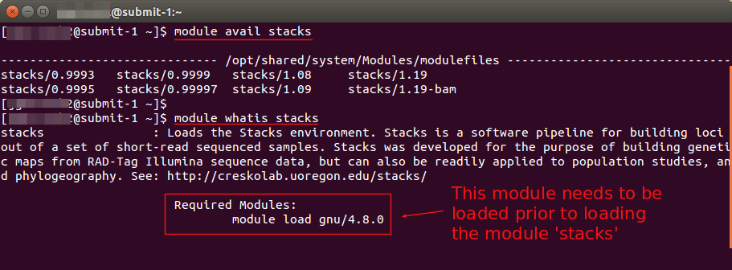
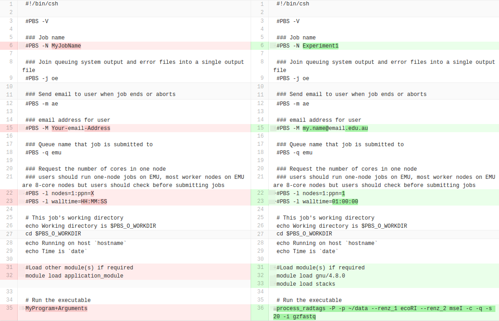
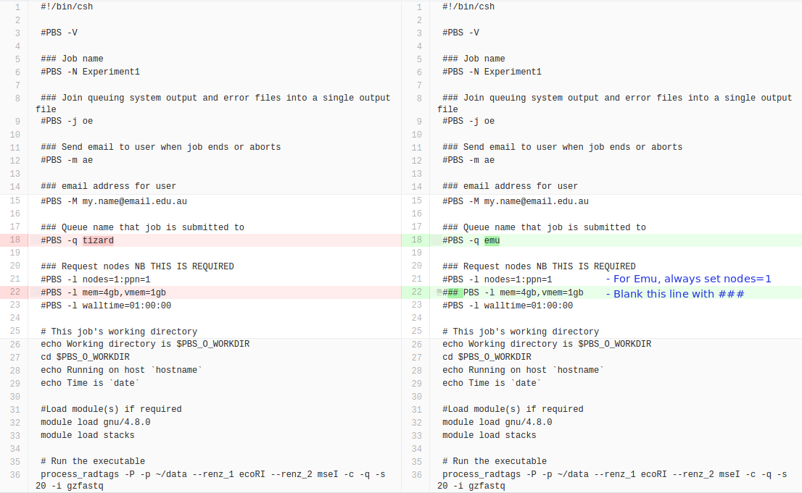

 

## SA node service for users in South Australia

* [About](#about)
* [Differences in the cloud](#differences-in-the-cloud)
* [Cloud vs HPC - which is better for my job?](#cloud-vs-hpc---which-is-better-for-my-job)
* [Register for an eRSA account](#register)
* [Emu submit node](#emu-head-node)
* [Connecting to Emu](#connecting-to-emu)
  * [Windows Users](#windows-users)
  * [Mac and Linux Users](#mac-users)
* [Storage](#storage)
* [General information on using eRSA Supercomputers](#general-information-on-using-ersa-supercomputers)
* [Exploring the available software](#modules)
* [Submitting your job](#torquepbs)
* [Transfer files with SCP and SFTP](#transfer)
* [Using your own cloud allocation](#cloud-allocation)
* [The Name](#the-name)
* [Appendices](#appendix)
  * [An example Torque submission script](#example)
  * [Converting a tizard submission script for Emu](#convert)
  * [A quick guide to copying files from eRSA '/data' storage](#app1)
* [Glossary](#glossary)

 

## About

Emu is a cluster that is designed to be similar to eRSA's Tizard supercomputer, but makes use of the [Australian Research Cloud][AustralianResearchCloud]. 
The Emu cluster-in-the-cloud is managed by eRSA and provides a shared service for eRSA users who don't have a resource allocation on the national cloud or don't have the expertise to set up and manage a private cluster-in-the-cloud using [StarCluster][StarCluster].

Emu currently consists of 136 processing cores, with an eight-core machine for the head node and 16 worker nodes to run jobs. Each node has eight cores, 32GB RAM and 240GB of local disk. The cluster uses the same job management system (Torque) and eRSA user accounts that are used on Tizard (and previously on Corvus). The cluster has access to the same repository of software packages as Tizard.

This service is designed for:

* South Australian researchers who want to run compute-intensive software applications in the cloud without the set-up involved in managing a virtual machine.
* Registered eRSA users familiar with Tizard HPC services, who would like to use their NeCTAR allocation to have their own node rather than share nodes with other users.

 

## Differences in the cloud

Due to technical constraints and security policies, we are unable to replicate everything in a traditional HPC cluster (such as Tizard) on the cloud. However, we aim to provide, as much as possible, a seamless experience for users in switching from a traditional HPC cluster to the cluster-in-the-cloud approach.

* Users employ the same eRSA account to log into Emu and the home directory on Emu will be the same as on Tizard. However, the '/data' storage is not automatically available. Email the [eRSA service desk][ServiceDesk] and it may be arranged for the '/data' disk to be made available through Emu. Otherwise, data can be [transferred using **sftp**](#app1) between '/data' and the cloud.
* The worker nodes in Emu are dynamic, which means they will be launched when there are pending jobs, and shut down when nodes are idle. Users may see a different number of worker nodes at different times when they check the status of the cluster.
* There is no wall-time restriction when running jobs with Emu when using your private project allocation.
* In the cloud, there is 4G memory allocated per core. So, if someone requests one core and 8GB memory for a job, it will be a waste. For such jobs it is recommended to run on the Tizard CPU cluster or big memory nodes. On Emu, users don't need to put the memory requirement in the job description file as the core/memory ratio is set by default.
* The same set of applications are available as for Tizard, however licensed software may not be functional in the cloud. Please contact our [Service Desk][ServiceDesk] if you need to run licensed software.

[Glossary of Terms](#glossary)   
[Top of page](#top)

---

 

## Cloud vs HPC

There are some differences between a cluster in the cloud and an HPC cluster, such as Tizard, which has more processors and memory on each node, and a faster communication network between the nodes. Some types of computation that run on HPC clusters are suitable for running in the cloud, and the cluster-in-the-cloud approach should work well for those.

* Run compute jobs in the same way as for eRSA HPC clusters (e.g Tizard)
* Any eRSA user can use Emu, you don't need to have a cloud resource allocation 
* If your research group has a cloud allocation, you can use it on Emu, so it's like having a private sub-cluster 
* There is no wall-time restriction on Emu if you use a cloud allocation (usually limited to 100 hours)

However, some types of applications are not well-suited to the cloud and would run better on HPC cluster. Examples of such applications include:

* Parallel programs that can run only on a single compute node and need more than eight processing cores or 32GB memory
* Parallel (multi-processor) programs that need to run on more than eight cores and can use multiple compute nodes (e.g. MPI programs) but require a lot of interprocessor communication, particularly low-latency communication
* Programs that need more than 4GB of memory per processing core
* Programs that have more than about 500GB total of input and output files
* Applications that run on GPUs

If you are unsure of whether or not your application is suitable for the cloud, contact our [Service Desk][ServiceDesk].

---

## Register for an eRSA account

To access the Emu cluster in the cloud, you will need to be [registered with eResearchSA](https://register.ersa.edu.au/). You will be provided with an eRSA username and password which you will use to access the Emu cluster. Email the [eRSA Helpdesk][ServiceDesk] with any queries.

 

## Emu submit node

* Emu's submit node is '**emu.ersa.edu.au**'
* To run jobs in the Emu cluster, you must login to the Emu submit node via SSH with your eRSA username and password.
* You can run short (a few minutes) test jobs on the commandline of the submit node without using the queueing system.
* Longer jobs are submitted to the Torque queueing system with a submission script.

[Glossary of Terms](#glossary)   
[Top of page](#top)

---

 

## Connecting to Emu

* Emu is accessible via SSH.
   
 

### Windows users

* Windows users can make use of free ssh clients such as putty. 
  * [Putty Download][PuttyDownload]  
  * [Instructions for downloading Putty][InstructionsfordownloadingPutty]

* In the Putty configuration window, enter **emu.ersa.edu.au** as the "Host Name (or IP Address)", then click 'Open'.
* You will be prompted for your username and password.

 

### Mac and Linux users

* Open the Terminal application (for Mac, look under Applications -> Utilities).
* Then run:  
  `ssh username@emu.ersa.edu.au`
* You will be prompted for your password.

[Glossary of Terms](#glossary)   
[Top of page](#top)

---

 

## Storage

* As with other clusters managed by eRSA, there are three storage areas that jobs have access to:
  * **/home/users**, which contains user home directories, and is accessible on all worker nodes via NFS but has limited space (50GB). 
  * **/scratch**, which provides a larger temporary storage area, and is accessible from all nodes of the cluster, but uses NFS and will therefore be slower than /tmp. This is the disk location from which the user must run jobs.
  * **/tmp**, which is fast, temporary storage that is local to a particular worker node in the cluster. It should be used only for the duration of a single job and cleaned up after the job has finished. On Emu it is 240GB per worker node, which is smaller than the local /tmp storageTizard nodes.
  

[Glossary of Terms](#glossary)   
[Top of page](#top)

---

 

## General information on using eRSA supercomputers

* Please read the general information about [Using Supercomputers][UsingSupercomputers], which is relevant to all eRSA supercomputers.

An overview of the steps for running a job on Emu (details in the following sections):

1. Create a folder in the '**/scratch**' directory to use as a working directory for running jobs
1. Copy the Emu submission script and your input files to this directory
1. Check which modules you need to load to run the job
1. Edit the emu submission script - with a comand-line editor or with [FileZilla][edit]
1. Submit the script, and await an email informing you the job is complete

## Exploring the available software packages  

The ['module' commands][modulecommands] allow users to:

* List the available packages (modules) on Emu  
  `module avail`  
  `module avail <search term> `  - search for a particular package  
* Find out what dependencies are required to be loaded before the package of interest can be loaded  
  `module whatis <package name>`  -  *make note of any required modules*
* Load the packages, by entering the `module load ...` command in the PBS submission script.

NOTE: If there is software that you would like to access that is not already in the software repository, email the [eRSA Helpdesk](mailto:servicedesk@ersa.edu.au) and request that it be added. Ensure you mention that you would like to access it through Emu cluster in the cloud.

 

## Submit your job using Torque/PBS queuing system

* As with all eRSA supercomputers, you submit jobs to Emu using the Torque job management (or queueing) system.
* [Introduction and Tutorial on using the Torque/PBS Queuing System][torque]
* [Running jobs with a Torque submission script][runningjobs]

There is a template of the Emu submission script in the home folder. After you have logged on to emu.ersa.edu.au, the script is in the '~/.templates' directory.

* look at the file:  
  `less ~/.templates/emu.sub`
* create a directory to work from in '/scratch',   
  e.g. `mkdir -p /scratch/MyDirectory/MyExperiment1`
* copy the emu submission script to your directory  
  e.g. `cp ~/.templates/emu.sub /scratch/MyDirectory/MyExperiment1/experiment1.sub`
* Navigate to the directory   
  e.g. `cd /scratch/MyDirectory/MyExperiment1`
* Edit the submission script with `nano experiment1.sub` (or use the file edit option in [FileZilla][edit])  
  * *Replace the following terms in* **bold** *in the submission script*
  * <tt>**MyJobName** </tt>
  * <tt>**Your-email-Address** </tt>
  * <tt>&#35;PBS -l ncpus=**X**</tt> - enter the number of processors required (up to 8, unless you have a private allocation with 16 CPUs)
  * <tt>&#35;PBS -l walltime=**HH:MM:SS**</tt> - Enter the maximum time the process will take to complete. If you are using a project cloud allocation, put "<tt>**###**</tt>" at the start of this line so it is ignored.
  * <tt>module load **application_module**</tt> - load any required modules first (see the output from the  `module whatis` command above). Then on a new line, load the program you will use.
  * <tt>**MyProgram+Arguments**</tt> - Enter the command to start the program, as you would enter it on the command line on your own computer.

* [Copy your input files](#transfer) to the directory.
* To submit the job, enter:  
  e.g. `qsub experiment1.sub`  
  `qstat` - check that the job is running. You will receive an email when the job ends.

  
[Glossary of Terms](#glossary)   
[Top of page](#top)

---

## Sharing files with the virtual machine  

There is a [NeCTAR training module][copy] and [support guide][transfer] with comprehensive details on transferring data between a cloud VM and your local computer or remote storage servers. 

Using programs like FileZilla or WinSCP is an easy method of transferring data from your local computer. 

See the [Appendix](#app1) for a quick guide to copying data between Emu and your eRSA /data storage. There is an [eRSA support page][ersatransfer] with more detail on transferring data from eRSA storage.

[Glossary of Terms](#glossary)   
[Top of page](#top)

---

## Using your own cloud allocation

Emu allows you the option to use your own NeCTAR cloud resource allocation to start-up worker nodes. These worker nodes will be exclusive to your group only and are not shared with other groups. A useful feature is that if all your worker nodes are busy, your job will be able to be scheduled to the shared worker nodes (contributed by eRSA) if any of them is free. If this is still not enough, you can request more cores from NeCTAR and we can bump up your own share in Emu so it can start up more exclusive worker nodes for you.

To set this up, you need to follow these steps:

* Follow this [guide to get a NeCTAR account][account]
* Apply for a [NeCTAR cloud resource allocation][allocation] by logging in to the [NeCTAR web dashboard][dashboard] and going to the New Request page under Allocations in the menu. Contact our [Service Desk][ServiceDesk] if you need help in filling in the allocation request.
* If you request persistent cloud storage ([volume storage][volume]), this can be set up to be used by your worker nodes. Note that this needs one extra core to run a file server. For example, if you need eight cores for your job, and you also request some volume storage, you will need to request a total of nine cores.
* Send an email to our [Service Desk][ServiceDesk] with the following information:
  * Your NeCTAR project name
  * A short, one-word name to identify your project in your Torque/PBS job submission script
  * How many worker nodes you want to be used by Emu and how many cores each one should have (note that the total number of cores must be less than or equal to your NeCTAR project allocation)
  * Do you have volume storage to use? If so, how much do you want to be accessible from Emu?
  * A list of users who are allowed to use these worker nodes (please provide their eRSA usernames).
* In order for eRSA to set up Emu in your project allocation, the project manager (the user who requested the allocation) must add the eRSA cloud support staff member as a user. This is done by selecting the "Users" option in the project menu on the NeCTAR [dashboard][users] and entering the email address of the eRSA team member that is assisting you.

Once we receive your email request, we will set up Emu to use your allocation. On completion of setup, you can add a flag `-A` when running your job script to specify the project name in order to make use of your dedicated worker nodes. In your Torque/PBS job script, add the following line (using your actual project name rather than `myprojectname`):

        #PBS -A myprojectname

Alternatively, you can specify the project name as a command line option to the qsub job submission command, as follows:

        $ qsub -A myprojectname myjobscript.sub

If you don't know or can't remember the project name, you can just type anything after the `-A` flag and you will get an error message telling you what project names you are eligible to use.

If you do not specify a project name, the job will be run on the shared worker nodes of the cluster.

If you want to run jobs ONLY on your own worker nodes, add `myprojectname` to the nodes' properties. For example, in the job scripts, it can be

        #PBS -l nodes=1:myprojectname

[Glossary of Terms](#glossary)   
[Top of page](#top)

---
        

## The name

* Clusters managed by eRSA have traditionally been given names of constellations. In this case, we also wanted to somehow incorporate the concept of "cloud". We chose the name based on a constellation from Aboriginal culture, the [Emu in the sky][emu], which is not based on stars, but rather on dust clouds in our galaxy creating dark areas in the Milky Way between the Southern Cross and Scorpius, which resemble the outline of an emu.

[Top of page](#top)

---

## Appendices

### An example Torque submission script

This is an example of modifying a copy of the 'emu.sub' submission script template to run an executable 'process_radtags' from a package called 'Stacks'. The first step is to check the availability of the package, and what modules need to be loaded first as a prerequisite for loading Stacks. Then the script is modified as highlighted for submission of the job.

[Top of page](#top)

---

### Modify a Tizard submision script for Emu

If you have an existing submission script based on the 'tizard.sub', you can convert it to an Emu submission script with the simple changes highlighted below.

[Top of page](#top)

---

### A quick guide to copying files from eRSA '/data' storage

The following information outlines commands that can be entered on your VM in order to transfer data to and from remote data storage, such as the eRSA '/data' storage block. There is an [eRSA support page][ersatransfer] with more detail on transferring data from eRSA storage.

#### SFTP via the Command Line 

Secure file transfer is also available between the VM and remote data storage. This is useful when you aren't sure of the file structure on the remote server, because it allows you to navigate to a file before you download it.

Enter the 'sftp' command while logged on to 'emu.ersa.edu.au', and you will have access to the remote storage server.

`sftp username@sftp.ersa.edu.au   `   - you will be prompted for a password.

You are now accessing the remote data storage server, and you can navigate the files on the server as per usual with commands like `cd` and `ls`.  
The commands `get` and `put` will transfer data between the machines:

* `get <remote_server_file.txt> <localEMU_destination/>`
  * `cd /data/<My directory>` , `ls` - navigate to your files on the remote server
  * `get file.data ./` - fetch the file from the server to the Emu working directory

* `put <localEMU_destination/file.txt> <remote_directory/>`
  * `put results.zip /data/<My directory>`

to close the sftp connection, type `exit`.

---

## Glossary

**Dashboard**
> The NeCTAR Dashboard is the main web-based interface for managing NeCTAR virtuals.

**ERSA**
> eResearch SA runs the South Australian node of the NeCTAR research cloud.

**HPC**
> High Performance Computing systems - typically refers to "high end" computing hardware designed for doing "large" computational tasks.

**Modules**
> [Environment modules][modules] are used to configure a users environment to allow use of the software packages available on the server. The module commands are used to find information on the available packages, and to load the packages for use. 

**Node** (compute node) 
> OpenStack terminology for a physical computer used to run virtual machines. It will typically have multiple CPUs and shared memory, and one or more network interfaces. It may also have on-node disk storage.

**Project**
> The NeCTAR term for a "resource container"; i.e. what you get when you are granted a NeCTAR allocation. A project "owns" virtual machine instances, snapshots and various kinds of storage, and may be shared by multiple users.

**SSH**
> A protocol and tools for establishing secure "shell" sessions over the network. SSH encrypts the data transferred, and supports user authentication using public/private keys.

**Submission script**
> A text file that is submitted to the [Torque queueing system][runningjobs] to run a job. It consists of lines that are not read by torque (beginning with ###), lines with Torque commands (beginning with #), and lines with shell script commands.

**Tizard**
> [Tizard][tizard] is eRSA's high performance computing server that can be used for complex data processing and analysis jobs that standard desktop computers would find it difficult or impossible to perform. It enables users to run many processing jobs with different parameters or input files more quickly.

**Volume Storage**
> Data Storage in your Virtual Machine that works like a hard-drive on your PC or laptop does. Volume storage is automatically available in your VM as the storage space for you system drive. Some flavors of VMs include an amount of ephemeral volume storage. Depending on your allocation you can have persistent volume storage attached to your VM.

[Full NeCTAR Glossary Page][glossary]  
[NeCTAR FAQ - general inormation](http://cloud.nectar.org.au/faq/)  
For more help, contact the [eRSA Helpdesk](mailto:servicedesk@ersa.edu.au)

[Top of page](#top)

[glossary]: https://support.nectar.org.au/support/solutions/articles/6000055445-glossary
[AustralianResearchCloud]: http://www.nectar.org.au/research-cloud/
[StarCluster]: star-cluster.html
[ServiceDesk]: mailto:servicedesk@ersa.edu.au
[PuttyDownload]: http://www.chiark.greenend.org.uk/~sgtatham/putty/download.html
[InstructionsfordownloadingPutty]: http://support.ersa.edu.au/hpc/putty-download.html
[UsingSupercomputers]: http://support.ersa.edu.au/hpc/using-supercomputers.html
[torque]: http://support.ersa.edu.au/hpc/torque-pbs-queuing-system-commands.html
[runningjobs]: http://support.ersa.edu.au/hpc/user-guide.html#running-jobs
[dashboard]: https://dashboard.rc.nectar.org.au/
[emu]: http://en.wikipedia.org/wiki/Australian_Aboriginal_astronomy#Emu_in_the_sky
[users]: https://dashboard.rc.nectar.org.au/project/members/
[transfer]: https://support.nectar.org.au/support/solutions/articles/6000085114-transferring-data-to-your-vm
[edit]: https://support.nectar.org.au/support/solutions/articles/6000085114-transferring-data-to-your-vm#edit
[copy]: http://training.nectar.org.au/package07/sections/copyFiles.html
[ersatransfer]: http://support.ersa.edu.au/storage/quick-start.html
[register]: https://register.ersa.edu.au/
[modules]: http://modules.sourceforge.net/
[modulecommands]: http://support.ersa.edu.au/hpc/module-commands.html
[account]: https://support.nectar.org.au/support/solutions/articles/6000055377-getting-an-account
[volume]: https://support.nectar.org.au/support/solutions/articles/6000055382-introduction-to-cloud-storage
[tizard]: http://www.ersa.edu.au/service/hpc/tizard/
[allocation]: https://support.nectar.org.au/support/solutions/articles/6000068044-managing-an-allocation
