  

## SA node service for users in South Australia

- [Introduction](#intro)
- [Cloud allocation](#alloc)
- [Creating a security group](#security)
- [Launching an instance](#instance)
- [Connecting to the virtual machine remotely with Windows Remote Desktop client](#desktop)
- [Sharing files with the virtual machine](#transferfiles)
- [Connecting from the Dashboard](#connection)
- [Glossary of Terms](#glossary) 

----

## Introduction 

[eResearchSA](https://www.ersa.edu.au/) is aiming to support South Australian users running 
Windows applications in the NeCTAR Australian research cloud. We are currently trialling an 
approach where users can access Windows virtual machines (VMs) in the cloud using Remote Desktop.

This is currently a pilot service which uses short-term Windows trial licenses, but eRSA will be providing a production service through a Microsoft Service Provider License Agreement (SPLA) in early 2016.

eRSA staff will need to set up your Windows VM image for the cloud. Once the image 
is created, you can set up a Windows virtual machine in the cloud by following the 
steps specified below, or eRSA staff can do it for you. Email [eRSA Helpdesk](mailto:servicedesk@ersa.edu.au) 
and we will assist you with getting started using Windows in the cloud.

This service is designed for:

- Researchers using software that is only available on Windows.
- Researchers that are more comfortable using the familiar environment of the windows
  desktop for their cloud computing.

[Glossary of Terms](#glossary)   
[Top of page](#top)

----

## Cloud allocation and Windows image

The Windows operating system is much larger than the standard Linux operating systems that are usually used on NeCTAR VMs. 
You will need to run the Windows image on an '**m2**' Instance type, which has a 30GB root
drive rather than 10 GB. You will need to request a [NeCTAR allocation][allocation] beyond the standard personal project
resource. By requesting more 'cores', you can launch instances that have enough storage to 
cope with the Windows operating system as well as storing and processing data.

Log in to the [web dashboard][dashboard] for the cloud 
and click on **New Request** under **Allocations** in the left hand side menu. Email the 
[eRSA Helpdesk](mailto:servicedesk@ersa.edu.au) if you have questions about any of the information in the form.
New requests can take a couple of weeks to process, and allocations are merit-based.

To access an image with the Windows operating system, under current licensing agreements, you need to be researching in South Australia
and be [registered with eResearchSA][register]. Email the [eRSA Helpdesk](mailto:servicedesk@ersa.edu.au)
to request an image to access Windows in the Cloud, and supply your NeCTAR username (the email address you use to 
log on to NeCTAR services) and the name of the project which has the allocations you 
have requested.  You will be emailed a username and password to access the Windows VM,
and an image with the Windows trial will be made available on your NeCTAR Dashboard.

[Glossary of Terms](#glossary)  
[Top of page](#top)

----

## Creating a security group

-  First you will need to create a security group to allow you to connect to the 
  virtual machine remotely with Windows remote desktop. 

-  Select "Access & Security" under the left hand side pane under "Compute".

-   Select the "Create Security Group" button near the top right corner

-  Give your security group a name and description and click the "Create Security Group" button

    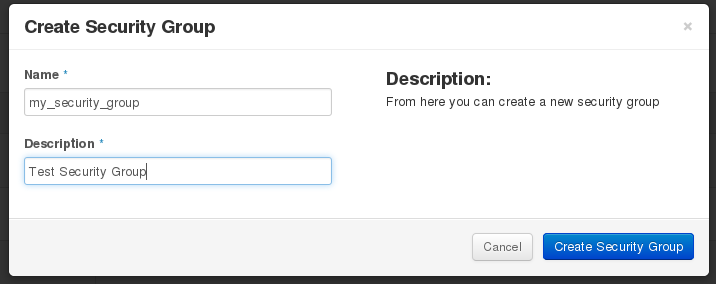

-  Click "Manage Rules" in the "Actions" drop-down menu

-  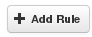 Click on the "Add Rule" button near the top right corner 

-  A small window should pop up. Make sure the "Rule" is set to "Custom TCP Rule" 
  and "Open Port" is set to "Port". Under the Port textbox enter "**3389**". Set "Remote" 
  to "CIDR" and under the "CIDR" textbox enter one of the following IP ranges as appropriate.
    - 129.127.0.0/16 - University of Adelaide
    - 129.96.0.0/16 - Flinders
    - 130.220.0.0/16 - UniSA  
-  E.g. for a user from the University of Adelaide:

  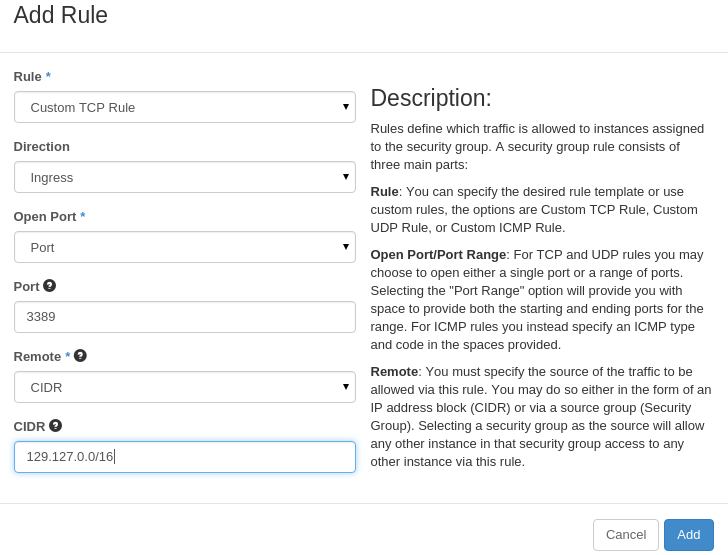

-  By specifying these IP ranges, your Windows VM will be more secure as it can only be accessed by computers in the University network, or using your university VPN. To access the Windows virtual desktop from elsewhere, you can log in via the [console on the NeCTAR dashboard](#connection).

[Glossary of Terms](#glossary)   
[Top of page](#top)

----

## Creating an instance with the Windows image

-  Select instance under the left hand side pane

-  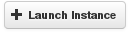 Select the "Launch Instance" button near the top right corner

-  In the pop-up window, assign a name to the Instance. Select a **Flavor** beginning with '**m2**',
  and ensure it has a 'Root Disk' of 30 GB (look in Flavor Details in the right column
  of the window; we suggest m2.large or m2.xlarge depending on how many processing cores and how much memory you need for your work). 
  In 'Instance Boot Source', ensure 'Boot from image' is selected. 
  Under 'Image Name', select the image that was set up for you by eRSA.

  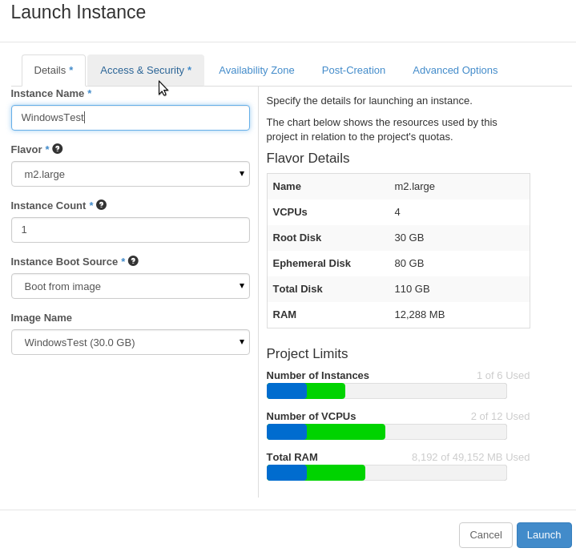

-  Under the "**Access & Security**" tab select the security group you created earlier. 
  In this example it was "my_security_group".

  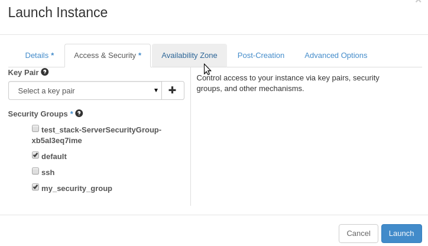

-  Under the "Availability Zone" tab select '**sa**';  
  Then click the blue 'Launch' button.

  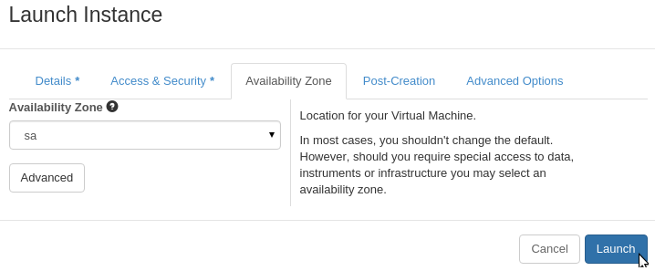

[Glossary of Terms](#glossary)   
[Top of page](#top)

----

## Connecting to the virtual machine remotely with Windows Remote Desktop client

- Other operating systems have similar remote desktop clients available that can be used almost
  identically (e.g. [Microsoft remote desktop][apple] is available for Mac, and there is a remote
  desktop client pre-installed on Ubuntu.

-  Take note of the instance IP address under the "Instances" page. You will need 
  this to connect to the virtual machine via remote desktop

-  On your local desktop, start the Remote Desktop client (it is preinstalled - 
  search in the start menu). 
  
- In the "Computer" field, enter the IP address of the instance from the previous step, then click connect.

  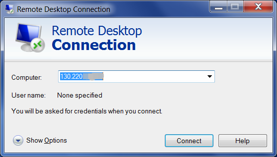

- You will be prompted to enter a username and password. These were supplied by eRSA when you requested the image for a Windows VM (this is not the same as your eRSA username and password).

  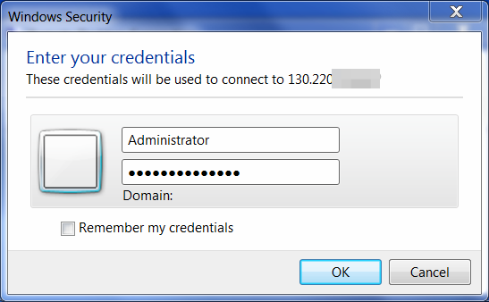

-  You will likely see a warning about accessing a remote computer, so tell your computer that it is ok to trust the VM by clicking "yes"

  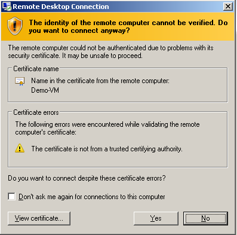

-  You should have now connected to the Windows virtual machine

  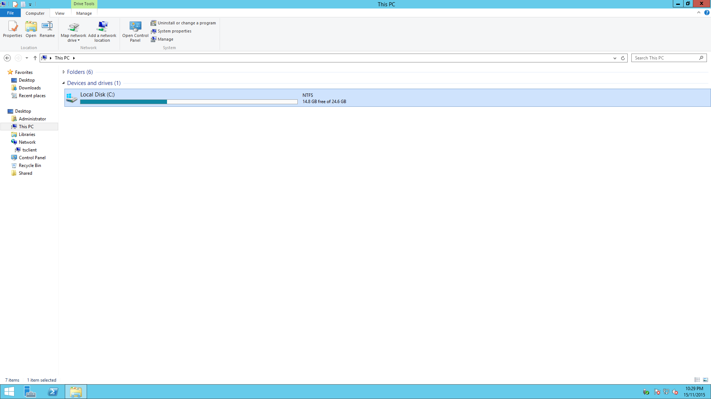

[Glossary of Terms](#glossary)   
[Top of page](#top)

----

## Sharing files with the virtual machine

-  The remote desktop client allows you to share disk drives between your local computer and the VM.

- At the remote dektop log-in window, click **Show Options**, then choose the **Local Resources** tab and click **More**.

  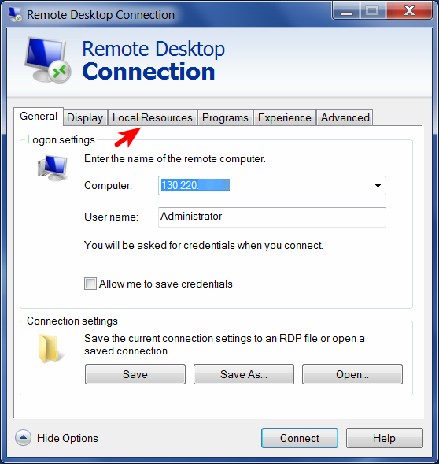  
  
  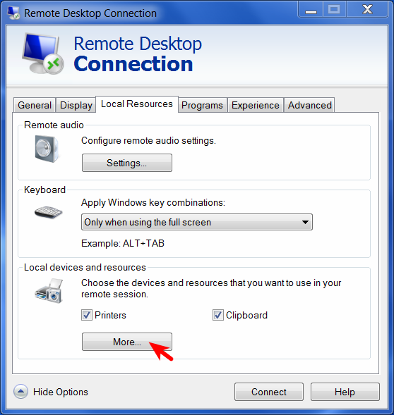

-  Choose which local disk drives you want to make available during your remote session and click 'OK'

  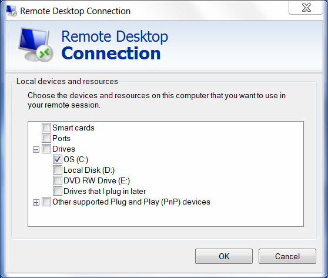

- Now when you connect to the windows VM, you will see the local drive amongst your devices.

  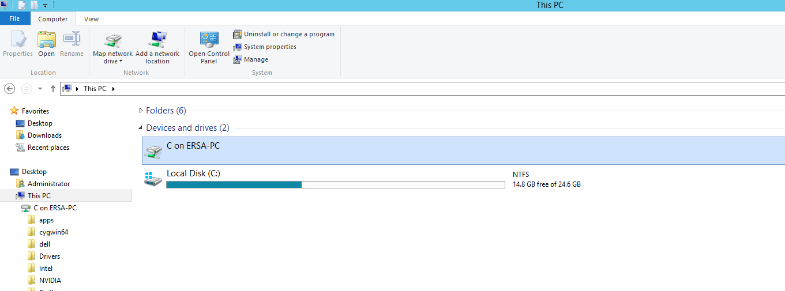

[Glossary of Terms](#glossary)   
[Top of page](#top)

----

## Allowing connections from the NeCTAR Dashboard

-  To have easy access to the remote desktop through your web browser from any computer, 
  you can use the **console** option in the *Instances** page of the [NeCTAR Dasboard][dashboard].

  

-  Log in to the virtual machine using the username and password supplied by eRSA 
  when you requested a Windows VM.
  (Note: these are NOT the same as the username and password for your eRSA account)

  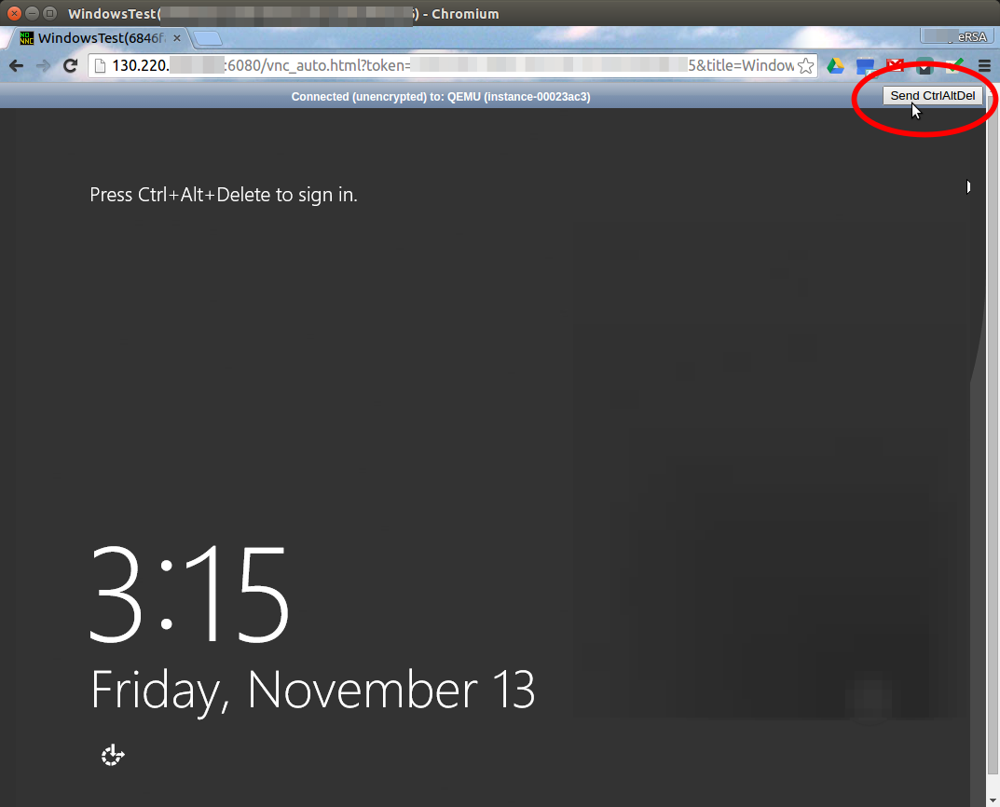
  
  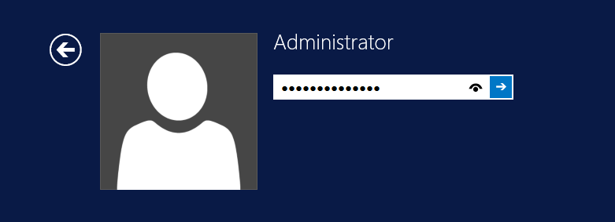

-  When you are finished, log off the virtual machine via Start button -> Log off

  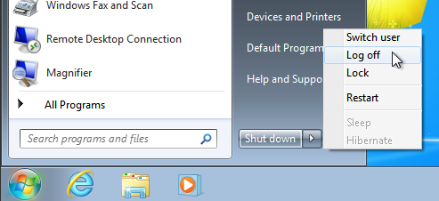 

[Top of page](#top)

----

### Glossary

**Availability Zone**
> A logical grouping of compute nodes within a region.

**Dashboard**
> The NeCTAR Dashboard is the main web-based interface for managing NeCTAR virtuals.

**ERSA**
> eResearch SA runs the South Australian node of the NeCTAR research cloud.

**Flavor**
> An OpenStack term for an instance sizing specification. Gives the amount 
> of memory, number of VCPUs and ephemeral disc size.

**Image**
> An image (or system image) is a copy of the entire state of a computer system 
> saved as a file. Images are used in two ways in NeCTAR. Firstly as a template for 
> Virtual Machines (VMs). You can launch a VM based on an image. 
> The second use of images is to preserve the state of a VM as configured by you as end user. 
> This type of image is usually referred to as a snapshot.

**Instance**
> An instance is a VM hosted on the NeCTAR OpenStack infrastructure.

**Project**
> The NeCTAR term for a "resource container"; i.e. what you get when you 
> are granted a NeCTAR allocation. A project "owns" virtual machine instances, snapshots 
> and various kinds of storage, and may be shared by multiple users.

**Security Group**
> A set of access rules that may be applied to one or more instances. 
> An access rule allows network access to an instance from other hosts with a 
> specified combination of protocol family (e.g. TCP, UDP, UCMP), port number and address range.

**Virtual Machine**
> A virtual machine (VM) is an operating system (OS) or application environment that 
> is installed on software which imitates dedicated hardware. The end user has the same 
> experience on a virtual machine as they would have on dedicated hardware.

**Volume Storage**
> Data Storage in your Virtual Machine that works like a hard-drive on your PC or 
> laptop does. Volume storage is automatically available in your VM as the storage 
> space for you system drive. Some flavors of VMs include an amount of ephemeral volume 
> storage. Depending on your allocation you can have persistent volume storage attached to your VM.

[Full Glossary Page][glossary]  
[NeCTAR FAQ - general inormation](http://cloud.nectar.org.au/faq/)  
For more help, contact the [eRSA Helpdesk](mailto:servicedesk@ersa.edu.au) or [NeCTAR support](https://support.nectar.org.au/support/tickets/new)  

[Top of page](#top)

[glossary]: https://support.nectar.org.au/support/solutions/articles/6000055445-glossary
[dashboard]: https://dashboard.rc.nectar.org.au/
[allocation]: https://dashboard.rc.nectar.org.au/project/request/
[apple]: https://itunes.apple.com/us/app/microsoft-remote-desktop/id715768417
[register]: https://register.ersa.edu.au/

